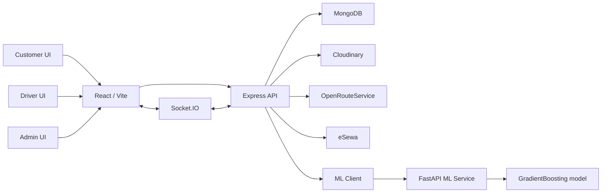
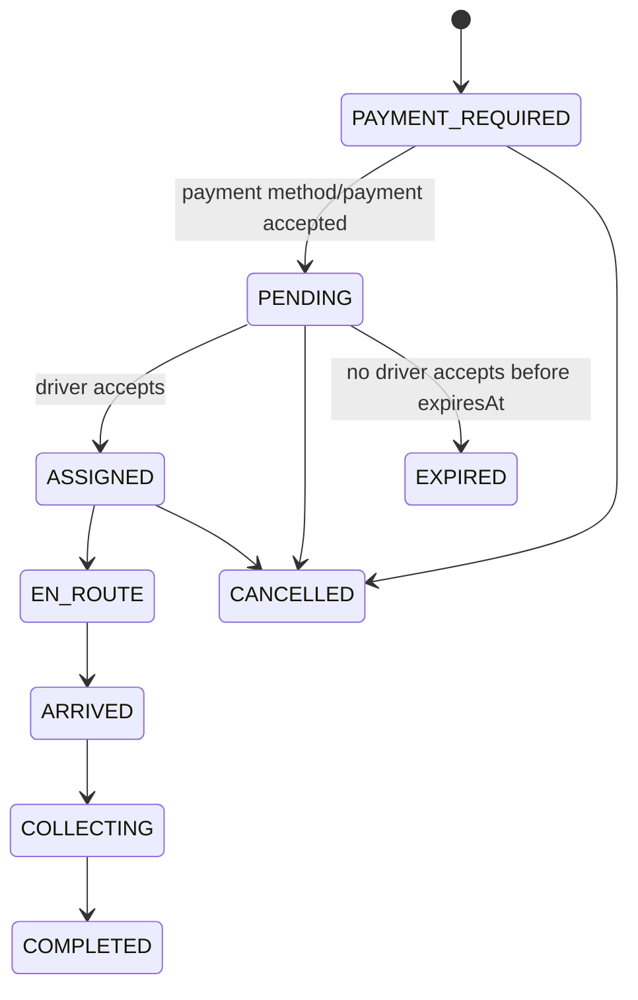

# SafaBin Nepal - Smart Waste Management Platform

SafaBin is a full-stack waste-management system for Nepal-focused municipal and organizational waste collection. It combines customer pickup requests, driver task flow, admin fleet management, real-time Socket.IO updates, monthly billing, eSewa/cash payments, Cloudinary waste uploads, and a Python ML service that predicts area-wise waste volume and generates daily truck dispatch schedules.

The project is split into three running apps:

```text
maskey-1/
  backend/       Express + MongoDB + Socket.IO API
  frontend/      React 19 + Vite + Zustand dashboard/client app
  ml/            FastAPI + scikit-learn waste prediction service
  scripts/       Seed scripts for initial data
```

## Table of Contents

- [What This App Does](#what-this-app-does)
- [Architecture](#architecture)
- [Roles and Access](#roles-and-access)
- [Setup](#setup)
- [Environment Variables](#environment-variables)
- [How to Run](#how-to-run)
- [Core Workflows](#core-workflows)
- [ML Scheduling](#ml-scheduling)
- [On-Demand Pickups](#on-demand-pickups)
- [Payments](#payments)
- [Monthly Billing](#monthly-billing)
- [Realtime Socket Events](#realtime-socket-events)
- [Background Jobs](#background-jobs)
- [Frontend Pages](#frontend-pages)
- [Backend API Map](#backend-api-map)
- [Data Models](#data-models)
- [Troubleshooting](#troubleshooting)

## What This App Does

SafaBin supports two collection styles:

1. Scheduled municipal collection
   - The ML service predicts waste volume per area for a date.
   - The backend assigns real MongoDB trucks and drivers.
   - Admins confirm schedules.
   - Drivers see assigned ML areas and mark them completed.

2. Customer on-demand pickup
   - Customer uploads waste image or selects waste details.
   - Customer chooses pickup location.
   - Backend estimates route distance and price.
   - Customer chooses cash or eSewa.
   - Only after payment method/payment flow is accepted does the request dispatch to drivers.
   - Driver accepts and moves through task statuses until complete.

The app also includes:

- OTP and password login.
- Super-admin organization management.
- Organization admin fleet, driver, truck, and area management.
- Driver assignment and truck assignment.
- Contact/support messages.
- Notifications.
- Historical pickup and completion reports.
- Pricing configuration for on-demand pickups.
- Monthly bills for customers and admins.
- Cash confirmation and eSewa integration.
- Cloudinary upload retention cleanup.
- Analytics dashboards from real pickup and ML schedule data.

## Architecture



### Backend

- Entry: `backend/server.js`
- Framework: Express 5
- Database: MongoDB through Mongoose
- Auth: JWT in `Authorization: Bearer <token>`
- Realtime: Socket.IO on the same HTTP server
- Cron: `node-cron`
- Uploads: Multer memory storage to Cloudinary
- Payments: eSewa signed payloads plus cash flows

### Frontend

- Entry: `frontend/src/main.jsx`
- Router: `frontend/src/routes/AppRoutes.jsx`
- API client: `frontend/src/utils/api.js`
- Socket client: `frontend/src/utils/socket.js`
- State: Zustand stores in `frontend/src/stores/`
- UI: role-based dashboards for customer, driver, admin, and super admin

### ML Service

- Entry: `ml/main.py`
- Framework: FastAPI
- Model: `GradientBoostingRegressor`
- Model files:
  - `ml/models/waste_predictor.pkl`
  - `ml/models/label_encoders.pkl`
- Data:
  - `ml/data/kathmandu_waste_data.csv`
- Predicts waste using district, day, month, weekend flag, holiday flag, holiday proximity, season, and district type.

## Roles and Access

The `User` model supports these roles:

| Role | Purpose |
| --- | --- |
| `super_admin` | Global owner. Manages organizations, all vehicles, all drivers, all users, global areas, pricing, ML reports, billing overview. |
| `admin` | Organization admin. Manages own organization, org trucks, org drivers, org billing, org pickups, org ML schedule view. |
| `driver` | Receives on-demand pickup requests, accepts tasks, updates pickup status, views ML area assignments, completes assigned ML areas. |
| `customer_admin` | Customer account. Uploads waste, creates pickup requests, pays bills, tracks pickups, views public schedule. |

Important access rules:

- Most routes require JWT auth through `authMiddleware`.
- Role checks use `roleMiddleware(...allowedRoles)`.
- Super admin sees global data.
- Admin data is usually scoped by `req.user.orgId`.
- Drivers can only update pickups assigned to their own user id.
- Customers can only pay or inspect pickups/bills they own.

## Setup

### Requirements

- Node.js 18+
- npm
- MongoDB
- Python 3.10+
- Cloudinary account for image uploads
- Optional: eSewa merchant/sandbox credentials
- Optional: OpenRouteService API key
- Optional: SMTP account for real OTP email

### Install Node Dependencies

```bash
npm install
cd frontend
npm install
cd ..
```

### Install ML Dependencies

```bash
cd ml
python -m venv .venv
.venv\Scripts\activate
pip install -r requirements.txt
```

If the model files are missing:

```bash
cd ml
python train.py
```

`train.py` loads `ml/data/kathmandu_waste_data.csv`. If the CSV does not exist, it generates synthetic Kathmandu Valley data first.

## Environment Variables

Create `.env` in the project root. The backend loads it from `../.env` relative to `backend/server.js`.

```env
# Server
PORT=5000
NODE_ENV=development
BACKEND_URL=http://localhost:5000
FRONTEND_URL=http://localhost:5173

# Database
MONGO_URL=mongodb://localhost:27017/safabin

# JWT
JWT_SECRET=change-this-secret
JWT_EXPIRES_IN=7d

# ML service
ML_SERVICE_URL=http://localhost:8000

# Cloudinary uploads
CLOUDINARY_CLOUD_NAME=your-cloud-name
CLOUDINARY_API_KEY=your-api-key
CLOUDINARY_API_SECRET=your-api-secret

# Optional cleanup endpoint protection
CRON_SECRET=your-cron-secret

# OTP email
SMTP_HOST=smtp.gmail.com
SMTP_PORT=587
SMTP_USER=your-email@gmail.com
SMTP_PASS=your-app-password
FROM_EMAIL=noreply@safabin.com

# Routes
ORS_API_KEY=your-openrouteservice-key

# eSewa
ESEWA_PRODUCT_CODE=your-product-code
ESEWA_SECRET_KEY=your-secret-key
ESEWA_BASE_URL=https://rc-epay.esewa.com.np
```

Create `frontend/.env`:

```env
VITE_API_BASE_URL=http://localhost:5000/api
VITE_API_URL=http://localhost:5000/api
```

Notes:

- Some frontend stores use `VITE_API_BASE_URL`; some older stores use `VITE_API_URL`.
- If these are missing, the frontend falls back to `http://localhost:5001/api`, while the backend default is `5000`. Set both frontend env vars to avoid confusion.
- eSewa needs `BACKEND_URL` because callbacks are generated as backend URLs.
- ML service defaults to `http://localhost:8000` if `ML_SERVICE_URL` is not set.

## How to Run

Use three terminals.

### 1. Backend

```bash
npm run dev
```

Backend runs on:

```text
http://localhost:5000
```

Health check:

```http
GET /api/health
```

### 2. Frontend

```bash
cd frontend
npm run dev
```

Frontend runs on:

```text
http://localhost:5173
```

### 3. ML Service

```bash
cd ml
.venv\Scripts\activate
uvicorn main:app --host 0.0.0.0 --port 8000 --reload
```

ML health:

```http
GET http://localhost:8000/health
```

## Core Workflows

## Authentication

### Register

`POST /api/auth/register`

Required:

- `name`
- `email`
- `phone`

Optional:

- `password`
- `address`
- `role`

What happens:

1. Backend checks duplicate email/phone.
2. Password is hashed if provided.
3. A 6-digit OTP is generated.
4. OTP is SHA-256 hashed and stored on the user.
5. OTP is emailed or sent through the SMS placeholder.
6. In development only, OTP is returned in the API response.

### OTP Login

1. `POST /api/auth/request-otp`
2. `POST /api/auth/verify-otp`

Rules:

- OTP expires after 10 minutes.
- OTP resend has a 60-second cooldown.
- Max verification attempts: 5.
- Expired or over-attempted OTPs are cleared.
- Successful OTP login clears OTP and returns JWT.

### Password Login

`POST /api/auth/login`

Works only for users with `passwordHash`. Users without password must use OTP.

## ML Scheduling

ML scheduling is one of the most important modules in the app.

### Services Involved

- Frontend page: `frontend/src/components/ml/MLScheduleDashboard.jsx`
- Frontend driver page: `frontend/src/components/ml/DriverMLAssignments.jsx`
- Backend route: `/api/ml-schedule`
- Backend controller: `backend/controllers/mlSchedule.controller.js`
- Backend ML client: `backend/services/mlClient.js`
- Python service: `ml/main.py`
- Python scheduler: `ml/scheduler.py`
- Mongo model: `MLSchedule`

### ML Endpoints

Python FastAPI service:

| Method | Endpoint | Purpose |
| --- | --- | --- |
| `GET` | `/health` | Checks model/service health. |
| `GET` | `/districts` | Returns trained areas and district types. |
| `POST` | `/predict` | Predicts one area/date. |
| `POST` | `/schedule` | Generates full date schedule predictions. |

Backend endpoints:

| Method | Endpoint | Roles | Purpose |
| --- | --- | --- | --- |
| `GET` | `/api/ml-schedule/public` | customer, admin, super_admin | Public/customer schedule view. |
| `GET` | `/api/ml-schedule/driver-assignments` | driver | Driver's today/tomorrow ML assignments. |
| `POST` | `/api/ml-schedule/:id/complete-area` | driver | Driver completes assigned area. |
| `GET` | `/api/ml-schedule/completions` | driver, admin, super_admin | Completion history. |
| `GET` | `/api/ml-schedule/health` | admin, super_admin | Backend checks ML service health. |
| `GET` | `/api/ml-schedule/analytics` | super_admin | ML reporting data. |
| `POST` | `/api/ml-schedule/predict` | admin, super_admin | Predict one area. |
| `POST` | `/api/ml-schedule/generate` | admin, super_admin | Generate draft schedule. |
| `GET` | `/api/ml-schedule` | admin, super_admin | List schedules. |
| `GET` | `/api/ml-schedule/:id` | admin, super_admin | Schedule detail. |
| `POST` | `/api/ml-schedule/:id/confirm` | admin, super_admin | Confirm schedule. |
| `POST` | `/api/ml-schedule/:id/redispatch` | admin, super_admin | Redispatch one skipped/reduced area. |

### How ML Prediction Works

For known trained areas:

1. The ML model receives district name and date.
2. It builds features:
   - encoded district
   - day of week
   - month
   - weekend flag
   - holiday flag
   - days to nearest holiday
   - encoded season
   - encoded district type
3. GradientBoosting predicts waste in kg.
4. Waste is categorized:
   - `< 500 kg`: `none`
   - `< 1500 kg`: `low`
   - `< 3500 kg`: `medium`
   - `< 6000 kg`: `high`
   - `>= 6000 kg`: `critical`
5. The service returns a recommendation.

For unknown/new DB areas:

1. Backend sends `district_type` and `scale_factor`.
2. ML averages predictions of trained areas with the same type.
3. It multiplies by `scale_factor`.
4. This lets new admin-created areas work without retraining.

Supported area types:

- `commercial`
- `residential`
- `suburban`
- `rural`

### How ML Schedule Generation Works

When an admin calls `POST /api/ml-schedule/generate`:

1. Backend fetches all available trucks.
2. Backend fetches all available drivers.
3. It maps drivers to trucks using `Driver.assignedTruckId`.
4. Trucks without drivers are removed from dispatch assignment.
5. Trucks without drivers are counted as `driverlessTrucks`.
6. Backend loads active DB areas and their organization mapping.
7. Backend sends ML service:
   - date
   - only trucks that have drivers
   - unavailable driver list
   - extra DB areas for type-based prediction
8. If the ML service is down, backend uses a deterministic fallback schedule.
9. Backend performs its own org-aware truck assignment.
10. Schedule is saved as `draft`.
11. Notifications/socket events are created for driverless or problematic schedules.

### Why a Schedule May Not Dispatch

An ML area will not dispatch when:

- Predicted waste category is `none`.
- There are no trucks with assigned drivers.
- All matching trucks are already assigned to other areas.
- The area's organization has no available truck with a driver.
- The driver is marked unavailable for that schedule request.
- The truck is not `isAvailable`.
- The driver is not `isAvailable`.

Important: a truck existing in the database is not enough. It must be available and assigned to an available driver. Otherwise it is counted as driverless and will not be used for dispatch.

### Dispatch vs Reduced vs Skip

| Action | Meaning |
| --- | --- |
| `dispatch` | Assigned truck capacity covers the predicted waste. |
| `reduced` | Some truck capacity is assigned, but not enough to fully cover expected waste. |
| `skip` | No truck assignment was possible or waste is negligible. |

### Confirmation Requirement

Generated schedules start as `draft`.

Drivers can see draft schedules in the driver assignment endpoint, but completing an ML area requires the schedule to be `confirmed` or `completed`.

If a driver tries to complete an area on a draft schedule, the backend rejects it with:

```text
Cannot complete assignments on a 'draft' schedule. Schedule must be confirmed first.
```

So the correct flow is:

```text
Generate schedule -> review draft -> confirm schedule -> drivers complete assigned areas
```

### Redispatch

Redispatch is for a single skipped/reduced area.

`POST /api/ml-schedule/:id/redispatch`

Body:

```json
{
  "area": "Baneshwor"
}
```

Redispatch:

1. Finds current available trucks with drivers.
2. Excludes trucks already assigned in that schedule.
3. Prefers trucks from the area's own organization.
4. Falls back to any available truck if no same-org truck exists.
5. Predicts that area again.
6. Assigns the closest capacity match.

Redispatch will fail if no available unassigned truck with a driver exists.

### Auto ML Cron

Backend schedules ML generation:

```text
0 0 * * *  -> every day at midnight server local time
```

On backend startup, it also waits 5 seconds and generates today's schedule if needed.

This means today's ML schedule can be created automatically when the backend starts, but the ML service and MongoDB must be reachable for the best result. If ML is unreachable, backend fallback predictions are used.

## On-Demand Pickups

On-demand pickups are separate from ML schedules. They are stored in `PickupRequest`, not `MLSchedule`.

### Main Frontend Flow

Customer:

1. Goes to Upload Waste / Schedule Pickup.
2. Selects category and level.
3. Chooses location and area.
4. Gets route and price estimate.
5. Creates pickup draft.
6. Chooses cash or eSewa.
7. Pickup is dispatched only after payment method/payment flow is initiated.

Driver:

1. Receives realtime pickup notification.
2. Accepts pickup.
3. Opens route/task page.
4. Moves through task statuses.
5. Completes pickup.
6. If cash, marks cash collected after completion.

### Pickup Estimate

`POST /api/pickups/estimate`

Body includes:

- `latitude`
- `longitude`
- `category`
- `level`
- `area`

Backend:

1. Resolves service area by exact area name or nearest configured area coordinates.
2. Requires that area to have an organization.
3. Requires organization depot coordinates.
4. Calls OpenRouteService from depot to customer.
5. Falls back to haversine route if ORS is missing or fails.
6. Calculates price from `PricingConfig`.

Price formula:

```text
categoryBase * levelMultiplier + distanceKm * distanceRatePerKm
```

Then minimum charge is applied.

Defaults:

- recyclable base: `500`
- non-recyclable base: `800`
- mixed/both base: `1000`
- easy multiplier: `1.0`
- medium multiplier: `2.5`
- hard multiplier: `5.0`
- distance rate: `50` NPR/km
- minimum charge: `500`

### Pickup Creation Does Not Immediately Dispatch

`POST /api/pickups`

The backend creates a pickup with:

```text
status = PAYMENT_REQUIRED
paymentStatus = UNPAID
```

This is intentional.

The pickup will not be emitted to drivers until the customer calls:

```http
POST /api/payments/initiate
```

with either:

```json
{ "pickupId": "...", "method": "cash" }
```

or:

```json
{ "pickupId": "...", "method": "esewa" }
```

For cash, dispatch happens after cash intent is recorded.

For eSewa, dispatch happens after eSewa success callback verifies the payment and marks it paid.

### Driver Matching

Driver matching lives in `backend/services/driverMatcher.js`.

Filters:

- Driver must be available.
- Driver must have an assigned truck.
- If pickup is tied to an org/area, truck must belong to that org.
- Truck capacity must satisfy the minimum capacity for waste level:
  - `easy`: `0 kg`
  - `medium`: `1000 kg`
  - `hard`: `3500 kg`

Scoring:

- Proximity: 50%
- Level/duty compatibility: 50%
- Category compatibility: currently 0%

Important: waste category is stored and shown, but category does not currently affect matching. Any truck can handle any category because `WEIGHTS.category = 0`.

Matching limits:

- Max radius: 30 km
- Minimum score: 0.3
- Max matched drivers: 5

If no drivers match, the request can broadcast to all drivers after payment flow dispatch.

### Pickup Status Lifecycle



Rules:

- Driver can accept only `PENDING` pickups.
- Driver status transitions are strict:
  - `ASSIGNED -> EN_ROUTE`
  - `EN_ROUTE -> ARRIVED`
  - `ARRIVED -> COLLECTING`
  - `COLLECTING -> COMPLETED`
- Only the assigned driver can update task status.
- Customer/admin can cancel only `PAYMENT_REQUIRED`, `PENDING`, or `ASSIGNED` pickups.
- Pending pickups expire after 10 minutes if not accepted.
- Expired pickups are not deleted; they remain for history and analytics.

## Payments

Pickup payments are stored in `Payment`.

### Pickup Payment Methods

| Method | How it works |
| --- | --- |
| `cash` | Creates a pending cash payment, changes pickup to `PENDING`, dispatches to drivers, and driver marks cash collected after pickup is complete. |
| `esewa` | Creates signed eSewa form fields. Pickup dispatches only after eSewa callback signature and status API verification succeed. |

### eSewa Security

The eSewa integration:

- Signs payloads with HMAC-SHA256.
- Uses server-generated `transaction_uuid`.
- Reads amount from the database, never from the client.
- Verifies callback signature.
- Calls eSewa status API server-to-server.
- Uses atomic `PENDING -> COMPLETED` update for idempotency.

Pickup payment callback routes are intentionally unauthenticated because eSewa cannot send the app JWT. Security is handled by signatures and status verification.

### Cash Pickup Rule

Drivers cannot mark cash collected before pickup completion.

Required:

- Pickup assigned to that driver.
- `paymentMethod = cash`
- `status = COMPLETED`
- Payment row status still `PENDING`

## Monthly Billing

Billing is separate from pickup payments.

Billing records are stored in `Billing`.

### Who Gets Bills

Monthly bills are generated for active:

- `customer_admin`
- `admin`

Drivers and super admins are not billed by this logic.

### Billing Fees

Defaults:

- Customer monthly fee: `500 NPR`
- Admin monthly fee: `1000 NPR`

Fees can be configured globally or per organization in `BillingConfig`.

Super admin:

- Can change global default fees.
- Can change org-specific fees.

Admin:

- Can change only own organization fees.
- Cannot change global defaults.

### Billing Generation

Billing can happen three ways:

1. Monthly cron:

```text
0 3 1 * *  -> 3:00 AM on the 1st day of every month
```

2. Manual admin action:

```http
POST /api/billing/admin/generate
```

3. Lazy creation when a user or admin opens billing views.

Important: the backend does not generate bills on startup. This avoids making every restart look like a billing run.

### Billing Statuses

| Status | Meaning |
| --- | --- |
| `UNPAID` | Open bill not yet paid. |
| `CASH_PENDING` | User selected cash; admin must confirm. |
| `PAID` | Paid through cash confirmation or verified eSewa. |
| `OVERDUE` | Due date is in the past and still unpaid. |
| `WAIVED` | Admin waived the bill. |

### Admin Shared Payment Behavior

If an admin bill is paid for an organization/month, other open admin bills in that same organization/month can be marked paid too. This is handled by `markOrgAdminPeriodPaid`.

## Cloudinary Waste Uploads

Customer image upload route:

```http
POST /api/user/upload-waste
```

Rules:

- Role: `customer_admin`
- Field name: `image`
- Allowed MIME types:
  - `image/jpeg`
  - `image/png`
  - `image/webp`
- Max size: 5 MB
- Upload target: `waste_uploads/<userId>/...`
- Metadata is saved in `WasteUpload`.
- Upload records expire after 30 days.

Cleanup:

- Daily at 2:00 AM server local time.
- Deletes expired Cloudinary asset first.
- Deletes Mongo record only after Cloudinary delete succeeds.
- Can also be called manually:

```http
GET /api/cron/cleanup-uploads?secret=<CRON_SECRET>
```

If `CRON_SECRET` is set, the endpoint requires it.

## Realtime Socket Events

Socket.IO authenticates with the same JWT.

Frontend socket reads token from persisted Zustand `auth-storage`.

Socket rooms:

| Room | Joined by | Used for |
| --- | --- | --- |
| `customer:<userId>` | customer | Personal pickup status updates. |
| `drivers` | all drivers | Broadcast pickup requests/cancellations. |
| `driver:<userId>` | driver | Targeted driver updates. |
| `admins` | admin and super_admin | Admin notifications and pickup/schedule events. |
| `org:<orgId>` | org admin | Org-scoped notifications. |
| `super_admins` | super_admin | Super admin scoped events. |

Common emitted events:

- `pickup:created`
- `pickup:accepted`
- `pickup:status`
- `pickup:statusUpdate`
- `pickup:cancelled`
- `pickup:expired`
- `schedule:area-completed`
- `assignment:completed`
- `notification:new`
- `notification:counts`

## Background Jobs

Defined in `backend/server.js`.

| Cron | Schedule | Purpose |
| --- | --- | --- |
| Upload cleanup | `0 2 * * *` | Deletes expired Cloudinary uploads and DB rows. |
| Pickup expiry | `*/1 * * * *` | Marks stale pending pickups as `EXPIRED`. |
| ML schedule | `0 0 * * *` | Generates today's ML schedule at midnight. |
| Billing | `0 3 1 * *` | Generates monthly bills on the first day of the month. |

Startup tasks:

- Connect MongoDB.
- Ensure pickup indexes.
- Ensure payment indexes.
- Expire stale pending pickups once.
- Start Socket.IO.
- Schedule cron jobs.
- Generate today's ML schedule after 5 seconds.

## Frontend Pages

### Public

- `/` - Home page, redirects admins to dashboard.
- `/login` - Customer/admin/driver login.
- `/signup` - Customer signup.
- `/about-us`
- `/our-team`
- `/contact-us`
- `/help-support`
- `/unauthorized`

### Customer

- `/customer-dashboard` - Customer pickup dashboard.
- `/schedule` - Public/customer schedule view.
- `/upload-waste` - Waste image and pickup flow.
- `/billing` - Customer monthly bills.
- `/payment-success`
- `/payment-failed`
- `/searching` - Pickup search/wait screen.
- `/profile`

### Driver

- `/driver-dashboard`
- `/accept-task`
- `/task-route/:pickupId`
- `/task-flow/:pickupId`
- `/driver-ml-assignments`
- `/driver-notifications`
- `/profile`

### Admin / Super Admin

Nested under `/admin-dashboard`:

- `/admin-dashboard` - dashboard analytics.
- `/admin-dashboard/organizations` - super admin only.
- `/admin-dashboard/organizations/:orgId` - super admin org detail.
- `/admin-dashboard/my-organization` - admin own org.
- `/admin-dashboard/vehicles`
- `/admin-dashboard/drivers`
- `/admin-dashboard/drivers/:driverId`
- `/admin-dashboard/admins`
- `/admin-dashboard/areas`
- `/admin-dashboard/notifications`
- `/admin-dashboard/ml-schedule`
- `/admin-dashboard/ml-schedule/history`
- `/admin-dashboard/history`
- `/admin-dashboard/pricing`
- `/admin-dashboard/billing`
- `/admin-dashboard/contact`
- `/admin-dashboard/users` - super admin only.
- `/admin-dashboard/pickup-stats` - super admin only.
- `/admin-dashboard/reports` - super admin only.

## Backend API Map

### Auth: `/api/auth`

- `POST /register`
- `POST /login`
- `POST /request-otp`
- `POST /verify-otp`
- `GET /me`

### Super Admin: `/api/super-admin`

- Organizations: create, list, detail, update, add admin.
- Analytics: global dashboard analytics.
- Vehicles: list, create, update, delete, unassign driver.
- Drivers: list, create, update, delete, detail, assign truck.
- Admins: delete admin.
- Users: list, detail, update.
- Deletion requests: list, count, approve/reject.
- Pickup stats: global pickup reports.

### Org Admin: `/api/org-admin`

- Admins: list/create/update org admins.
- Organization: view/update own organization.
- Trucks: add/list/update/unassign.
- Drivers: list/create/update/detail.
- Assign driver to truck.
- Review legacy on-demand `Task` requests.
- Estimate waste volume.
- Create deletion requests for drivers/vehicles.
- Org analytics.

### Driver: `/api/driver`

- `GET /me`
- `GET /tasks`
- `PUT /tasks/:taskId/accept`
- `PUT /tasks/:taskId/complete`
- `PUT /location`
- `GET /` - list drivers for admin roles.

### Schedule: `/api/schedule`

Manual schedule CRUD:

- `GET /`
- `GET /:id`
- `POST /`
- `PUT /:id`
- `DELETE /:id`

This is the manual schedule model, separate from ML schedules.

### Areas: `/api/areas`

- `GET /` - admin sees own org; super admin sees all.
- `GET /:id`
- `POST /` - super admin only.
- `PUT /:id` - super admin only.
- `DELETE /:id` - soft delete by setting inactive.

Areas power:

- ML extra area prediction.
- Org-scoped truck assignment.
- Pickup org resolution.
- Route depot/organization mapping.

### Pickups: `/api/pickups`

- `GET /analytics` - admin/super_admin.
- `GET /all` - admin/super_admin.
- `POST /estimate` - customer.
- `POST /` - customer creates pickup draft.
- `GET /my-pickups` - customer dashboard data.
- `POST /route` - driver route from current location to pickup.
- `GET /pending` - driver pending pickups.
- `GET /active` - driver active pickup.
- `GET /my-history` - driver history.
- `GET /:id` - pickup detail.
- `GET /:id/events` - audit events.
- `POST /:id/accept` - driver accepts.
- `POST /:id/status` - driver status transition.
- `POST /:id/cancel` - customer/admin cancel.

### Payments: `/api/payments`

- `POST /initiate` - customer chooses pickup payment method.
- `GET|POST /esewa/success` - eSewa pickup callback.
- `GET|POST /esewa/failure` - eSewa pickup failure callback.
- `POST /:pickupId/cash-collected` - driver settles cash after completion.
- `GET /pickup/:pickupId` - payment detail.
- `GET /all` - admin/super_admin payment list.

### Billing: `/api/billing`

- `GET /my-bills`
- `POST /pay/:billingId`
- `GET /history`
- `GET|POST /esewa/success`
- `GET|POST /esewa/failure`
- `GET /admin/overview`
- `GET /admin/accounts/:customerId`
- `PUT /admin/:billingId/waive`
- `PUT /admin/:billingId/confirm-cash`
- `POST /admin/generate`
- `GET /config`
- `PUT /config`

### ML Schedule: `/api/ml-schedule`

See [ML Scheduling](#ml-scheduling).

### Notifications: `/api/notifications`

- `GET /unread-count`
- `GET /`
- `PUT /read-all`
- `PUT /:id/read`

Roles:

- `admin`
- `super_admin`
- `driver`

### Contact: `/api/contact`

- `POST /submit` - public contact form.
- `POST /admin-submit` - admin support/contact.
- `GET /unread-count` - admin/super_admin.
- `GET /messages` - admin/super_admin.
- `PUT /:id/read` - admin/super_admin.
- `DELETE /:id` - super admin only.

### User Upload/Legacy Task: `/api/user`

- `POST /pickup-request` - legacy task-based on-demand request.
- `GET /requests/:taskId/status`
- `POST /upload-waste`

Modern pickup flow uses `/api/pickups`; this route still exists for upload and older task flows.

### Other

- `/api/location` - CRUD locations.
- `/api/internal-messages` - internal org admin/driver messages.
- `/api/history` - admin pickup/customer/driver history.
- `/api/pricing-config` - pickup pricing config.
- `/api/health` - backend health.
- `/api/cron/cleanup-uploads` - manual upload cleanup.

## Data Models

### User

Stores account identity, role, org membership, password hash, OTP state, phone/address/location, and active status.

### Organization

Stores organization name, depot location, admins, and fleet references.

### Driver

Links a driver user to availability, current location, and assigned truck.

Important: many dispatch flows require `Driver.assignedTruckId`.

### Truck

Stores waste truck category, capacity, duty type, organization, license plate, availability.

Duty type is auto-classified from capacity:

- `< 1000 kg`: light duty
- `1000-3500 kg`: medium duty
- `> 3500 kg`: heavy duty

### Area

Stores named service areas, type, coordinates, scale factor, organization, and active flag.

Used by:

- ML extra areas.
- Org-aware ML schedule assignment.
- Customer pickup org resolution.
- Depot/route pricing.

### MLSchedule

Stores generated ML schedule for a date:

- date/day/status
- total predicted waste
- summary counts
- areas with predictions/actions/assigned trucks
- generated/confirmed metadata
- model info

Each assigned truck inside an ML area has its own completion state.

### PickupRequest

Stores on-demand pickup lifecycle:

- customer
- waste upload
- location/area/org
- category/level
- matched drivers
- status
- assigned driver
- timestamps
- pricing/route data
- payment method/status
- status history
- expiry timestamp

Records are retained even after expiry/completion for dashboards and audit.

### PickupEvent

Append-only audit events for pickup lifecycle:

- created
- matched
- broadcast
- accepted
- rejected
- en route
- arrived
- collecting
- completed
- cancelled
- expired
- reassigned

### Payment

Transaction record for pickup payments. Supports cash and eSewa.

### Billing

Monthly bill per user and period. Unique per `customerId + billingYear + billingMonth`.

### BillingConfig

Global or organization-specific monthly fee configuration.

### WasteUpload

Cloudinary image metadata with 30-day expiry.

### Notification

Persistent notification records for admin/driver events.

### ContactMessage

Public/admin support messages.

### DeletionRequest

Org admins cannot directly delete certain drivers/vehicles. They request deletion; super admin reviews and approves/rejects.

## ML Model Details

The ML dataset models Kathmandu Valley-style areas:

- Kathmandu-Core
- Baneshwor
- Koteshwor
- Balaju
- Maharajgunj
- Budhanilkantha
- Tokha
- Chandragiri
- Lalitpur
- Satdobato
- Kirtipur
- Imadol
- Lubhu
- Godawari
- Dakshinkali
- Bhaktapur
- Madhyapur Thimi
- Suryabinayak
- Changunarayan
- Nagarkot

The synthetic generator covers 2024-01-01 to 2025-12-31 by default and adds:

- seasonality
- weekend effects
- monsoon effects
- Nepal holiday/festival spikes
- area type differences
- random noise

Holiday data covers major Nepal holidays and festivals from 2024 through 2026.

The model metadata reports:

```text
model = GradientBoosting
r2_score = 0.974
```

## Why Something Will Not Work

### ML schedule will not assign trucks

Check:

- Are trucks `isAvailable: true`?
- Does each truck belong to an organization?
- Is there a `Driver` document for the driver user?
- Is `Driver.isAvailable: true`?
- Is `Driver.assignedTruckId` set to that truck?
- Is the area assigned to an organization?
- Is the schedule still `draft` when driver is trying to complete it?

### On-demand pickup is created but drivers do not see it

This is usually expected until payment flow starts.

Check:

- Pickup status after creation is `PAYMENT_REQUIRED`.
- Customer must call `/api/payments/initiate`.
- For cash, dispatch happens immediately after method selection.
- For eSewa, dispatch happens only after successful verified callback.
- Socket requires a valid JWT.
- Driver must be connected and in `drivers` or `driver:<id>` room.

### Pickup expires

Pending pickups expire after 10 minutes. The cron runs every minute and marks them `EXPIRED`. They are not deleted.

### Driver cannot update pickup status

Check:

- Driver must be assigned to that pickup.
- Transition must be exactly the next expected status.
- You cannot jump from `ASSIGNED` directly to `COMPLETED`.

### Cash collection fails

Cash pickup settlement requires:

- Assigned driver.
- Pickup status `COMPLETED`.
- Payment method `cash`.
- Pending cash payment row.

### Estimate fails

Check:

- Area exists and is active.
- Area has `orgId`.
- Organization has depot latitude and longitude.
- `ORS_API_KEY` is optional, but without it route falls back to haversine.

### eSewa fails

Check:

- `ESEWA_PRODUCT_CODE`
- `ESEWA_SECRET_KEY`
- `ESEWA_BASE_URL`
- `BACKEND_URL`
- `FRONTEND_URL`
- Callback amount must match the stored database amount.
- Callback signature must verify.
- Status API must return `COMPLETE`.

### Images do not upload

Check:

- Cloudinary env vars.
- File field name is `image`.
- File is JPEG, PNG, or WebP.
- File size is 5 MB or less.

### Frontend calls wrong backend port

Set both:

```env
VITE_API_BASE_URL=http://localhost:5000/api
VITE_API_URL=http://localhost:5000/api
```

Some older stores still use `VITE_API_URL`.

## Seed Scripts

Root scripts:

```bash
npm run seed
node scripts/seedAreas.js
```

Backend utility scripts:

```bash
node backend/scripts/backfillPickupOrgId.js
node backend/scripts/migrateBillingConfig.js
```

Use these carefully against the intended MongoDB database.

## Development Notes

- The repo currently has both modern `PickupRequest` flow and older `Task` request flow.
- ML schedules and on-demand pickups are intentionally separate data sources.
- Dashboard analytics combine pickup analytics and ML schedule analytics in some views.
- Socket events are best-effort; server logic continues even if Socket.IO is not initialized in scripts/tests.
- Payment and pickup expiry indexes are repaired on backend startup.
- Pickup expiry uses an index, not Mongo TTL deletion, because pickup history must remain available.
- Billing overview may lazily backfill missing bills with a short cache window.

## Production Checklist

- Use a strong `JWT_SECRET`.
- Set `NODE_ENV=production`.
- Restrict CORS with `FRONTEND_URL`.
- Use real SMTP or SMS provider.
- Use production eSewa credentials/base URL.
- Set `BACKEND_URL` to public backend URL for callbacks.
- Set Cloudinary credentials.
- Set `CRON_SECRET`.
- Run the ML service with a process manager.
- Confirm MongoDB indexes after first boot.
- Make sure frontend env points to deployed API.
- Confirm organization depot coordinates and area-org mappings before enabling pickups.

## License

ISC
