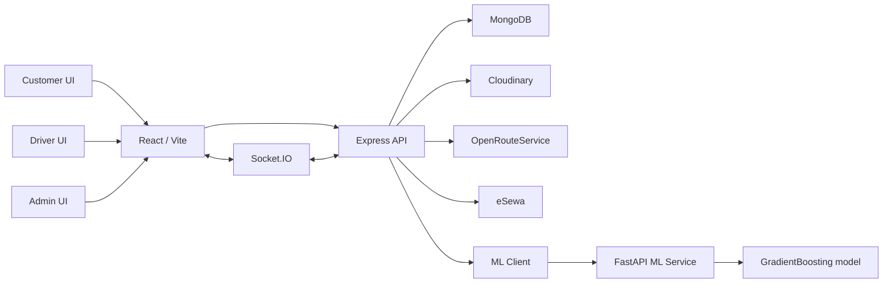
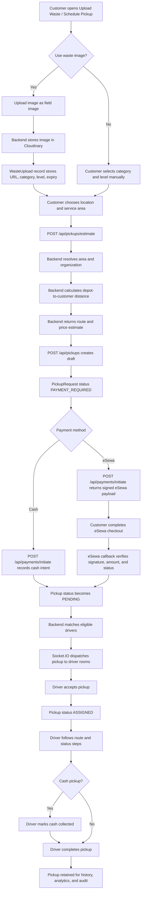
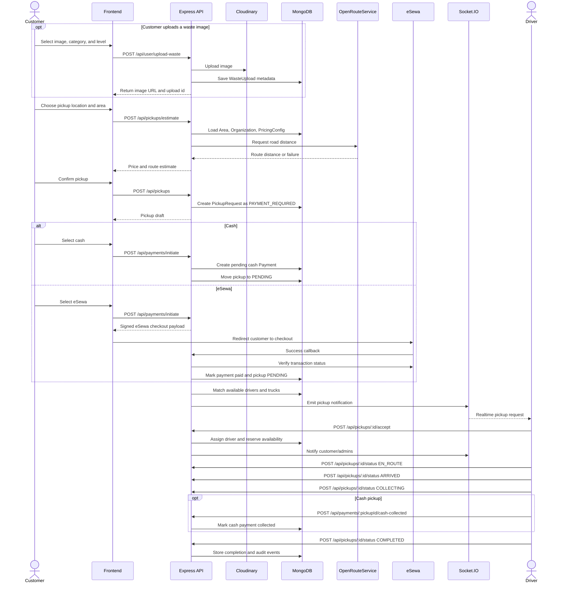
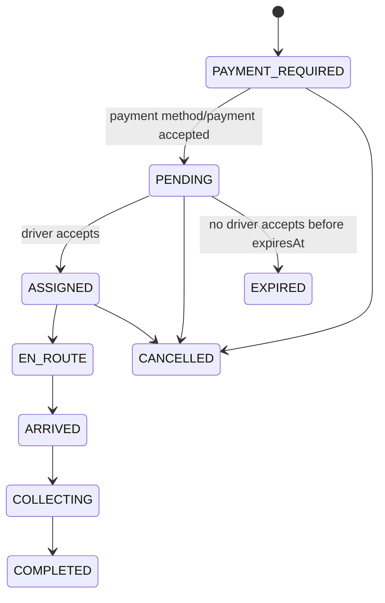

# Advance Waste Management System Nepal - Smart Waste Management Platform

This system is a full-stack waste-management system for Nepal-focused municipal and organizational waste collection. It combines customer pickup requests, driver task flow, admin fleet management, real-time Socket.IO updates, monthly billing, eSewa/cash payments, Cloudinary waste uploads, and a Python ML service that predicts area-wise waste volume and generates daily truck dispatch schedules.

The project is split into three running apps:

```text
maskey-1/
  backend/       Express + MongoDB + Socket.IO API
  frontend/      React 19 + Vite + Zustand dashboard/client app
  ml/            FastAPI + scikit-learn waste prediction service
  scripts/       Seed scripts for initial data
```

## Table of Contents

- [What This App Does](#what-this-app-does)
- [Architecture](#architecture)
- [Roles and Access](#roles-and-access)
- [Repository Tour](#repository-tour)
- [Setup](#setup)
- [Quick Start for Developers](#quick-start-for-developers)
- [Dependency Guide](#dependency-guide)
- [Environment Variables](#environment-variables)
- [How to Run](#how-to-run)
- [How to Work With the Codebase](#how-to-work-with-the-codebase)
- [How to Test](#how-to-test)
- [Quality Gates, CI, and Tests](#quality-gates-ci-and-tests)
- [Core Workflows](#core-workflows)
- [ML Scheduling](#ml-scheduling)
- [On-Demand Pickups](#on-demand-pickups)
- [Payments](#payments)
- [Monthly Billing](#monthly-billing)
- [Realtime Socket Events](#realtime-socket-events)
- [Background Jobs](#background-jobs)
- [Frontend Pages](#frontend-pages)
- [Backend API Map](#backend-api-map)
- [Data Models](#data-models)
- [Development Notes](#development-notes)
- [Troubleshooting](#why-something-will-not-work)

## What This App Does

This system supports two collection styles:

1. Scheduled municipal collection
   - The ML service predicts waste volume per area for a date.
   - The backend assigns real MongoDB trucks and drivers.
   - Admins confirm schedules.
   - Drivers see assigned ML areas and mark them completed.

2. Customer on-demand pickup
   - Customer uploads waste image or selects waste details.
   - Customer chooses pickup location.
   - Backend estimates route distance and price.
   - Customer chooses cash or eSewa.
   - Only after payment method/payment flow is accepted does the request dispatch to drivers.
   - Driver accepts and moves through task statuses until complete.

The app also includes:

- OTP and password login.
- Super-admin organization management.
- Organization admin fleet, driver, truck, and area management.
- Driver assignment and truck assignment.
- Contact/support messages.
- Notifications.
- Historical pickup and completion reports.
- Pricing configuration for on-demand pickups.
- Monthly bills for customers and admins.
- Cash confirmation and eSewa integration.
- Cloudinary upload retention cleanup.
- Analytics dashboards from real pickup and ML schedule data.

## Architecture



### Backend

- Entry: `backend/server.js`
- Framework: Express 5
- Database: MongoDB through Mongoose
- Auth: JWT in `Authorization: Bearer <token>`
- Realtime: Socket.IO on the same HTTP server
- Cron: `node-cron`
- Uploads: Multer memory storage to Cloudinary
- Payments: eSewa signed payloads plus cash flows

### Frontend

- Entry: `frontend/src/main.jsx`
- Router: `frontend/src/routes/AppRoutes.jsx`
- API client: `frontend/src/utils/api.js`
- Socket client: `frontend/src/utils/socket.js`
- State: Zustand stores in `frontend/src/stores/`
- UI: role-based dashboards for customer, driver, admin, and super admin

### ML Service

- Entry: `ml/main.py`
- Framework: FastAPI
- Model: `GradientBoostingRegressor`
- Model files:
  - `ml/models/waste_predictor.pkl`
  - `ml/models/label_encoders.pkl`
- Data:
  - `ml/data/kathmandu_waste_data.csv`
- Predicts waste using district, day, month, weekend flag, holiday flag, holiday proximity, season, and district type.

## Roles and Access

The `User` model supports these roles:

| Role | Purpose |
| --- | --- |
| `super_admin` | Global owner. Manages organizations, all vehicles, all drivers, all users, global areas, pricing, ML reports, billing overview. |
| `admin` | Organization admin. Manages own organization, org trucks, org drivers, org billing, org pickups, org ML schedule view. |
| `driver` | Receives on-demand pickup requests, accepts tasks, updates pickup status, views ML area assignments, completes assigned ML areas. |
| `customer_admin` | Customer account. Uploads waste, creates pickup requests, pays bills, tracks pickups, views public schedule. |

Important access rules:

- Most routes require JWT auth through `authMiddleware`.
- Role checks use `roleMiddleware(...allowedRoles)`.
- Super admin sees global data.
- Admin data is usually scoped by `req.user.orgId`.
- Drivers can only update pickups assigned to their own user id.
- Customers can only pay or inspect pickups/bills they own.

## Repository Tour

This repository is organized as a practical full-stack system. The root folder owns the backend runtime, shared scripts, root lockfile, and CI-facing commands. The frontend and ML service each keep their own dependency files because they run as separate applications.

```text
maskey-1/
  .github/workflows/ci.yml       GitHub Actions workflow for backend tests and frontend lint/build
  .env                           Local secrets and runtime configuration; never commit real secrets
  .env.example                   Safe template showing required environment keys
  package.json                   Root Node package for backend commands and shared scripts
  package-lock.json              Exact installed root Node dependency graph
  README.md                      Main project documentation
  backend/                       Express API, MongoDB models, controllers, services, domains, sockets, tests
  frontend/                      React/Vite single page app
  ml/                            FastAPI waste prediction and scheduling service
  scripts/                       Root-level seed scripts
```

### Backend Folder

```text
backend/
  server.js                      Starts MongoDB, HTTP server, Socket.IO, cron jobs, and route mounting
  app.js                         Builds the Express app, middleware stack, and API route table
  config/                        Database, JWT, Cloudinary, and other integration configuration
  controllers/                   Request/response handlers for older route modules
  domains/                       Newer domain-oriented modules split by route/controller/service/repository/policy
  middlewares/                   Auth, role checks, rate limits, uploads, and request protection
  models/                        Mongoose schemas and database indexes
  routes/                        Express routers for legacy and application routes
  services/                      Business logic and integration helpers used by controllers
  socket/                        Socket.IO server setup and room/event helpers
  tests/                         Node test runner tests for app-level behavior
  utils/                         Shared helpers for responses, errors, roles, validation, OTP, coordinates
  scripts/                       Backend data migration/backfill scripts
```

Important backend idea: this codebase currently has two styles side by side. Older features use `routes/`, `controllers/`, `models/`, and `services/`. Newer features under `domains/` are more modular and keep route, controller, service, repository, policy, validation, and tests close together.

### Frontend Folder

```text
frontend/
  index.html                     Vite HTML entry
  package.json                   Frontend dependency and script list
  vite.config.js                 Vite, React, and Tailwind integration
  eslint.config.js               ESLint flat config
  src/main.jsx                   React app bootstrap
  src/App.jsx                    App shell
  src/routes/AppRoutes.jsx       Role-aware frontend route definitions
  src/pages/                     Page-level screens
  src/components/                Reusable UI, dashboard, driver, user, landing, map, ML, and auth components
  src/stores/                    Zustand stores for auth, users, pickups, billing, schedules, vehicles, etc.
  src/utils/                     API client, request helpers, socket setup, role routing, error reporting
  src/hooks/                     Shared React hooks
  src/context/                   Dashboard theme context/provider
  src/assets/                    Local images used by landing and UI pages
```

Important frontend idea: pages are mostly thin screens that compose components and stores. Zustand stores own async calls and shared state for each feature area. API requests go through `src/utils/api.js` and related helpers.

### ML Folder

```text
ml/
  main.py                        FastAPI app exposing health, prediction, and scheduling endpoints
  model.py                       Waste prediction model loading and prediction helpers
  scheduler.py                   Schedule generation logic using predictions and constraints
  train.py                       Training script for the saved scikit-learn model
  data_generator.py              Synthetic Kathmandu Valley waste dataset generator
  nepal_holidays.py              Nepal holiday/festival features for model inputs
  requirements.txt               Python dependencies
  data/kathmandu_waste_data.csv  Training data used by the model
  models/*.pkl                   Saved trained model, encoders, and metrics
```

Important ML idea: the backend calls this service over HTTP through `backend/services/mlClient.js`. The ML service does not directly own MongoDB data. It predicts and returns scheduling information; the backend converts those results into persistent `MLSchedule` records.

### Root Scripts

Root `package.json` scripts:

| Script | Command | What it is for |
| --- | --- | --- |
| `npm start` | `node backend/server.js` | Starts the backend once, normally used for production-like local runs. |
| `npm run dev` | `nodemon backend/server.js` | Starts the backend in development and restarts when backend files change. |
| `npm test` | `node --test` | Runs backend and domain tests with Node's built-in test runner. |
| `npm run lint:frontend` | `npm --prefix frontend run lint -- --max-warnings=0` | Runs frontend ESLint from the root and fails on warnings. |
| `npm run build:frontend` | `npm --prefix frontend run build` | Builds the production frontend bundle from the root. |
| `npm run seed` | `node scripts/seed.js` | Seeds initial data for local development. |

Frontend `package.json` scripts:

| Script | Command | What it is for |
| --- | --- | --- |
| `npm run dev` | `vite` | Starts the React dev server. |
| `npm run build` | `vite build` | Creates the optimized production bundle. |
| `npm run lint` | `eslint .` | Runs ESLint across the frontend source. |
| `npm run preview` | `vite preview` | Serves the already-built production bundle locally. |

## Setup

### Requirements

- Node.js 18+
- npm
- MongoDB
- Python 3.10+
- Cloudinary account for image uploads
- Optional: eSewa merchant/sandbox credentials
- Optional: OpenRouteService API key
- Optional: SMTP mailbox for local OTP email and/or Brevo account with a verified sender for hosted OTP email

### Install Node Dependencies

```bash
npm install
cd frontend
npm install
cd ..
```

### Install ML Dependencies

```bash
cd ml
python -m venv .venv
.venv\Scripts\activate
pip install -r requirements.txt
```

If the model files are missing:

```bash
cd ml
python train.py
```

`train.py` loads `ml/data/kathmandu_waste_data.csv`. If the CSV does not exist, it generates synthetic Kathmandu Valley data first.

## Quick Start for Developers

For day-to-day local development, use this shortest reliable path:

```bash
npm install
cd frontend
npm install
cd ..
```

Create local environment files:

```bash
copy .env.example .env
copy ml\.env.example ml\.env
```

Then edit `.env` so these values agree with the ports you actually use:

```env
PORT=5000
BACKEND_URL=http://localhost:5000
FRONTEND_URL=http://localhost:5173
ML_SERVICE_URL=http://localhost:8000
MONGO_URL=mongodb://localhost:27017/maskey
```

Start the app in three terminals:

```bash
# Terminal 1: backend API
npm run dev

# Terminal 2: frontend app
cd frontend
npm run dev

# Terminal 3: ML service
cd ml
.venv\Scripts\activate
uvicorn main:app --host 0.0.0.0 --port 8000 --reload
```

Open the frontend at:

```text
http://localhost:5173
```

Useful health checks:

```text
http://localhost:5000/api/health
http://localhost:8000/health
```

Before opening a pull request, run the same checks CI runs:

```bash
npm test
npm run lint:frontend
npm run build:frontend
```

On Windows PowerShell, if `npm` is blocked by the local script execution policy, use `npm.cmd` instead:

```bash
npm.cmd test
npm.cmd run lint:frontend
npm.cmd run build:frontend
```

## Dependency Guide

This section explains what every declared package is doing in this project. Version numbers are controlled by the package files and lockfiles; the explanations here focus on purpose.

### Root Backend Dependencies

These packages are declared in the root `package.json` and are used mainly by the Express backend, shared scripts, and server-side integrations.

| Package | Used for |
| --- | --- |
| `@tailwindcss/vite` | Tailwind's Vite integration. It is mostly frontend-oriented, but it is present in the root dependency list too. |
| `axios` | Server-side HTTP client. Used when backend code needs to call another service such as the ML service, eSewa status APIs, or other HTTP integrations. |
| `bcryptjs` | Password hashing and password comparison for login/register flows. It lets the app store password hashes instead of plain passwords. |
| `cloudinary` | Cloudinary SDK for uploading, storing, and deleting customer waste images. |
| `cookie-parser` | Parses incoming HTTP cookies into `req.cookies`. Useful when routes need cookie-based data, even though JWT bearer auth is the main auth style. |
| `cors` | Enables controlled cross-origin requests from the React frontend to the backend API. |
| `dotenv` | Loads `.env` variables into `process.env` during local/runtime startup. |
| `express` | Main backend web framework. It defines middleware, JSON parsing, API routes, health checks, and error flow. |
| `express-rate-limit` | Protects sensitive endpoints such as auth and OTP routes from abuse by limiting repeated requests. |
| `helmet` | Adds common HTTP security headers to reduce browser-side attack surface. |
| `jsonwebtoken` | Creates and verifies JWT access tokens used by protected API routes and Socket.IO auth. |
| `mongoose` | MongoDB object modeling library. Defines schemas, models, indexes, queries, and document updates. |
| `multer` | Handles multipart form uploads. In this project it receives waste image files before streaming them to Cloudinary. |
| `node-cron` | Runs scheduled background jobs such as upload cleanup, pickup expiry, ML schedule generation, and monthly billing. |
| `nodemailer` | Sends OTP emails through SMTP when using the local development mail configuration. |
| `nodemon` | Development server watcher. Restarts the backend when files change. |
| `socket.io` | Realtime backend server for pickup dispatch, status updates, admin notifications, and driver/customer rooms. |
| `streamifier` | Converts upload buffers into readable streams, which is useful for streaming Multer memory uploads into Cloudinary. |
| `tailwindcss` | Utility-first CSS framework dependency. The frontend uses Tailwind; it is also declared at the root. |
| `websocket` | WebSocket protocol package. Socket.IO is the primary realtime library, so this package is likely legacy or reserved for direct WebSocket needs. |

### Frontend Runtime Dependencies

These packages are declared in `frontend/package.json` under `dependencies` and are shipped or bundled for the React app.

| Package | Used for |
| --- | --- |
| `@gsap/react` | React integration helpers for GSAP animations. |
| `@react-three/drei` | Ready-made helpers for React Three Fiber, such as controls, loaders, camera helpers, and common 3D utilities. |
| `@react-three/fiber` | React renderer for Three.js. Used to build 3D scenes with React components. |
| `@tailwindcss/vite` | Connects Tailwind CSS v4 to the Vite build pipeline. |
| `axios` | Browser HTTP client used by stores and API helpers to call backend endpoints. |
| `chart.js` | Charting engine for dashboard analytics and reports. |
| `gsap` | Animation library used for richer UI motion. |
| `leaflet` | Map rendering library used for location picking, route display, and map-based UI. |
| `lucide-react` | Icon library used for buttons, navigation, dashboards, and compact UI actions. |
| `motion` | Animation library for React UI transitions and interactive motion. |
| `react` | Core UI library for building the frontend component tree. |
| `react-chartjs-2` | React wrapper around Chart.js so charts can be used as React components. |
| `react-dom` | React package that renders the app into the browser DOM. |
| `react-hot-toast` | Toast notification UI for success/error/status feedback. |
| `react-leaflet` | React bindings for Leaflet maps. |
| `react-router-dom` | Client-side routing and navigation for public, customer, driver, admin, and super admin pages. |
| `socket.io-client` | Browser Socket.IO client for realtime pickup and notification events. |
| `tailwindcss` | Utility-first CSS framework used by the frontend styling system. |
| `three` | Core 3D rendering library used by React Three Fiber components. |
| `zustand` | Lightweight state management. Stores live under `frontend/src/stores/`. |

### Frontend Development Dependencies

These packages support linting, type hints, Vite, and build analysis. They are not business features by themselves.

| Package | Used for |
| --- | --- |
| `@eslint/js` | Base ESLint JavaScript rules for the flat ESLint config. |
| `@types/react` | Type metadata for React APIs. Helpful for editor intelligence even in a JavaScript project. |
| `@types/react-dom` | Type metadata for React DOM APIs. |
| `@vitejs/plugin-react` | Official Vite plugin for React transform, Fast Refresh, and JSX handling. |
| `eslint` | Static analysis tool that catches many code quality, import, hook, and syntax issues before runtime. |
| `eslint-plugin-react-hooks` | Enforces React hook rules such as stable hook order and dependency arrays. |
| `eslint-plugin-react-refresh` | Helps keep Vite React Fast Refresh boundaries valid. |
| `globals` | Provides known browser/global variable definitions for ESLint. |
| `rollup-plugin-visualizer` | Bundle analysis tool for inspecting production build size and dependency contribution. |
| `vite` | Frontend dev server and production bundler. |

### Python ML Dependencies

These packages are declared in `ml/requirements.txt`.

| Package | Used for |
| --- | --- |
| `fastapi` | Python web API framework for the ML service. |
| `uvicorn` | ASGI server that runs the FastAPI app. |
| `scikit-learn` | Machine learning library used for `GradientBoostingRegressor` and preprocessing utilities. |
| `pandas` | Dataframe library used for loading, cleaning, generating, and transforming tabular waste data. |
| `numpy` | Numeric computing library used under pandas/scikit-learn and for feature/math operations. |
| `joblib` | Saves and loads trained model and encoder `.pkl` files. |
| `python-dotenv` | Lets Python code load `.env` configuration where needed. |
| `pydantic` | Request/response validation and typed data models used by FastAPI. |

### Dependency Files and Lockfiles

| File | Purpose |
| --- | --- |
| `package.json` | Root Node dependency list and backend/shared scripts. |
| `package-lock.json` | Exact root Node package tree. Commit this so installs are reproducible. |
| `frontend/package.json` | Frontend dependency list and frontend scripts. |
| `frontend/package-lock.json` | Exact frontend package tree. Commit this for reproducible frontend installs. |
| `ml/requirements.txt` | Python package requirements for the ML service. |

Use `npm install <package>` only when intentionally adding or updating a dependency. Use `npm ci` when you want a clean install that exactly follows the lockfile, like CI does.

## Environment Variables

Create `.env` in the project root. The backend loads it from `../.env` relative to `backend/server.js`.

```env
# Server
PORT=5000
NODE_ENV=development
APP_TIMEZONE=Asia/Kathmandu
BACKEND_URL=http://localhost:5000
FRONTEND_URL=http://localhost:5173

# Database
MONGO_URL=mongodb://localhost:27017/safabin

# JWT
JWT_SECRET=change-this-secret
JWT_EXPIRES_IN=7d

# ML service
ML_SERVICE_URL=http://localhost:8000

# Cloudinary uploads
CLOUDINARY_CLOUD_NAME=your-cloud-name
CLOUDINARY_API_KEY=your-api-key
CLOUDINARY_API_SECRET=your-api-secret

# Optional cleanup endpoint protection
CRON_SECRET=your-cron-secret
METRICS_SECRET=your-metrics-secret

# OTP email
# Local development: SMTP is used when Brevo values are empty
SMTP_HOST=smtp.gmail.com
SMTP_PORT=587
SMTP_USER=your-email@gmail.com
SMTP_PASS=your-app-password
FROM_EMAIL=your-email@gmail.com

# Production/Render: Brevo API is used when these values are configured
BREVO_API_KEY=
BREVO_SENDER_EMAIL=
BREVO_SENDER_NAME=Safabin Nepal
BREVO_TIMEOUT_MS=10000

# Routes
ORS_API_KEY=your-openrouteservice-key

# eSewa
ESEWA_PRODUCT_CODE=your-product-code
ESEWA_SECRET_KEY=your-secret-key
ESEWA_BASE_URL=https://rc-epay.esewa.com.np

# Request size and rate limits
JSON_BODY_LIMIT=1mb
URLENCODED_BODY_LIMIT=1mb
AUTH_RATE_LIMIT_MAX=20
OTP_REQUEST_RATE_LIMIT_MAX=5
OTP_VERIFY_RATE_LIMIT_MAX=10
```

Create `frontend/.env`:

```env
VITE_API_BASE_URL=http://localhost:5000/api
VITE_API_URL=http://localhost:5000/api
```

Notes:

- Some frontend stores use `VITE_API_BASE_URL`; some older stores use `VITE_API_URL`.
- If these are missing, the frontend falls back to `http://localhost:5000/api`, matching the backend default.
- `.env.example` may use `PORT=5001`; either port is fine as long as `BACKEND_URL`, `FRONTEND_URL`, and frontend API env values agree.
- eSewa needs `BACKEND_URL` because callbacks are generated as backend URLs.
- ML service defaults to `http://localhost:8000` if `ML_SERVICE_URL` is not set.

### Backend Environment Variable Reference

| Variable | Required | What it controls |
| --- | --- | --- |
| `PORT` | No | Backend HTTP port. Defaults to `5000` in `backend/server.js`. |
| `NODE_ENV` | No | Runtime mode. In production, CORS is restricted to `FRONTEND_URL`. |
| `APP_TIMEZONE` | No | Timezone used for scheduled jobs. Defaults to `Asia/Kathmandu`. |
| `BACKEND_URL` | Yes for payments | Public backend URL used for eSewa callbacks and generated backend links. |
| `FRONTEND_URL` | Yes | Browser app origin used by CORS, Socket.IO, and payment redirects. |
| `MONGO_URL` | Yes | MongoDB connection string. |
| `JWT_SECRET` | Yes | Secret used to sign and verify access tokens. Use a long random value. |
| `JWT_EXPIRES_IN` | No | JWT lifetime, such as `7d`. |
| `ML_SERVICE_URL` | No | FastAPI ML service URL. Defaults to `http://localhost:8000` in the ML client. |
| `CLOUDINARY_CLOUD_NAME` | Yes for uploads | Cloudinary cloud name for waste image storage. |
| `CLOUDINARY_API_KEY` | Yes for uploads | Cloudinary API key. |
| `CLOUDINARY_API_SECRET` | Yes for uploads | Cloudinary API secret. |
| `CRON_SECRET` | Recommended | Protects manual cron cleanup endpoint when set. |
| `METRICS_SECRET` | Optional | Protects the metrics endpoint when set. |
| `SMTP_HOST` | Yes for local SMTP email | Development SMTP server hostname. Ignored when Brevo values are configured. |
| `SMTP_PORT` | No | Development SMTP port. Defaults to `587`. |
| `SMTP_USER` | Yes for local SMTP email | Development SMTP username. |
| `SMTP_PASS` | Yes for local SMTP email | Development SMTP password or app password. |
| `FROM_EMAIL` | No | SMTP sender address. Defaults to `SMTP_USER`. |
| `BREVO_API_KEY` | Yes for hosted email | Brevo transactional email API key. When configured with `BREVO_SENDER_EMAIL`, Brevo is used instead of SMTP. |
| `BREVO_SENDER_EMAIL` | Yes for hosted email | Email address verified as a sender in Brevo, including a verified Gmail address for testing. |
| `BREVO_SENDER_NAME` | No | Sender name shown on OTP emails. Defaults to `Safabin Nepal`. |
| `BREVO_TIMEOUT_MS` | No | Timeout for Brevo API email requests. Defaults to `10000`. |
| `ORS_API_KEY` | Optional | OpenRouteService key for road distance routing. Without it, pickup estimate can fall back to haversine distance. |
| `ESEWA_PRODUCT_CODE` | Yes for eSewa | eSewa merchant/product code. |
| `ESEWA_SECRET_KEY` | Yes for eSewa | Secret used to sign and verify eSewa payloads. |
| `ESEWA_BASE_URL` | Yes for eSewa | eSewa base URL. Use sandbox/RC URL for testing. |
| `JSON_BODY_LIMIT` | No | Max JSON request body size. Defaults to `1mb`. |
| `URLENCODED_BODY_LIMIT` | No | Max form-urlencoded request body size. Defaults to `1mb`. |
| `AUTH_RATE_LIMIT_MAX` | No | Maximum auth attempts per rate-limit window. Defaults to `20`. |
| `OTP_REQUEST_RATE_LIMIT_MAX` | No | Maximum OTP request attempts per window. Defaults to `5`. |
| `OTP_VERIFY_RATE_LIMIT_MAX` | No | Maximum OTP verification attempts per window. Defaults to `10`. |

### Frontend Environment Variable Reference

| Variable | Required | What it controls |
| --- | --- | --- |
| `VITE_API_BASE_URL` | Recommended | Main API base URL used by most frontend API helpers. |
| `VITE_API_URL` | Recommended | Older API base URL used by some stores. Keep it equal to `VITE_API_BASE_URL`. |

All Vite environment variables exposed to browser code must start with `VITE_`.

## How to Run

Use three terminals.

### 1. Backend

```bash
npm run dev
```

Backend runs on:

```text
http://localhost:5000
```

Health check:

```http
GET /api/health
```

### 2. Frontend

```bash
cd frontend
npm run dev
```

Frontend runs on:

```text
http://localhost:5173
```

### 3. ML Service

```bash
cd ml
.venv\Scripts\activate
uvicorn main:app --host 0.0.0.0 --port 8000 --reload
```

ML health:

```http
GET http://localhost:8000/health
```

## How to Work With the Codebase

Use the project as three related apps that run together:

| Area | Where to work | What to change there |
| --- | --- | --- |
| Backend API | `backend/` | Express routes, controllers, services, domain modules, Mongoose models, auth, sockets, jobs, and tests. |
| Frontend app | `frontend/` | React pages, reusable components, Zustand stores, API helpers, routes, styling, and frontend build/lint fixes. |
| ML service | `ml/` | FastAPI endpoints, prediction logic, scheduling logic, training data, and model training files. |
| Seeds/scripts | `scripts/` and `backend/scripts/` | Local data setup, backfills, and one-off maintenance scripts. |

Recommended development flow:

1. Pull the latest code and install dependencies with `npm install` at the root and inside `frontend/`.
2. Copy `.env.example` to `.env`, then update MongoDB, port, Cloudinary, eSewa, email-provider, and ML values for your machine.
3. Run backend, frontend, and ML service in separate terminals.
4. Make backend API changes together with focused tests under `backend/tests/` or the related `backend/domains/**/tests/` folder when present.
5. Make frontend changes through stores and API helpers instead of calling `fetch` directly from page components.
6. Keep role behavior in mind. Check customer, driver, admin, and super-admin flows when touching shared auth, billing, pickup, or dashboard logic.
7. Run `npm test`, `npm run lint:frontend`, and `npm run build:frontend` before pushing.

Backend conventions:

- `backend/app.js` builds the Express app and is test-friendly.
- `backend/server.js` starts MongoDB, HTTP, Socket.IO, and cron jobs.
- Older features live in `routes/`, `controllers/`, `services/`, and `models/`.
- Newer features live under `domains/` with route, controller, service, repository, policy, validation, and test files kept closer together.
- Use `authMiddleware` and `roleMiddleware(...)` for protected routes.
- Keep organization scoping explicit for admin routes and user ownership checks explicit for customer/driver routes.

Frontend conventions:

- Add or update API calls in `frontend/src/utils/` or the relevant Zustand store in `frontend/src/stores/`.
- Keep page components focused on layout and composition.
- Put reusable UI in `frontend/src/components/`.
- Use `VITE_API_BASE_URL` and `VITE_API_URL` consistently in `frontend/.env`.
- Run `npm run lint` inside `frontend/` while working on UI changes.

ML conventions:

- Run the ML service from the `ml/` directory so relative model/data paths resolve correctly.
- If `ml/models/*.pkl` files are missing or stale, run `python train.py` from `ml/`.
- Keep backend persistence in the backend. The ML service should return predictions and schedule suggestions; the backend stores accepted schedules in MongoDB.

## How to Test

### Full Local Check

Run this from the repository root before pushing:

```bash
npm test
npm run lint:frontend
npm run build:frontend
```

On Windows PowerShell, use `npm.cmd test`, `npm.cmd run lint:frontend`, and `npm.cmd run build:frontend` if the shell blocks `npm.ps1`.

These commands match the main CI checks:

| Command | What it verifies |
| --- | --- |
| `npm test` | Backend and domain tests using Node's built-in test runner. |
| `npm run lint:frontend` | Frontend ESLint with zero warnings allowed. |
| `npm run build:frontend` | Production Vite build for the React app. |

### Backend Tests

Run all backend tests:

```bash
npm test
```

Run one test file:

```bash
node --test backend/tests/pickupLifecycle.test.js
```

Current backend tests include:

| Test file | Coverage focus |
| --- | --- |
| `backend/tests/appArchitecture.test.js` | App structure, route wiring, and import safety. |
| `backend/tests/authBillingSecurity.test.js` | Auth, billing, payment, and security-sensitive behavior. |
| `backend/tests/knapsackOptimization.test.js` | Scheduling optimization behavior. |
| `backend/tests/pickupLifecycle.test.js` | On-demand pickup lifecycle and driver/customer flow. |

Add backend tests when changing:

- auth or role checks
- pickup creation, dispatch, acceptance, completion, cancellation, or expiry
- billing or payment logic
- organization scoping
- schedule generation or assignment
- shared middleware, validators, or response helpers

### Frontend Checks

Run frontend lint directly:

```bash
cd frontend
npm run lint -- --max-warnings=0
```

Run the production build directly:

```bash
cd frontend
npm run build
```

Preview the built frontend:

```bash
cd frontend
npm run preview
```

The frontend currently has lint/build checks but no dedicated unit test script. For UI changes, verify the affected route manually in the browser and run the lint/build commands above.

### ML Service Checks

There is no dedicated ML test script in `ml/` yet. Use these smoke checks after changing prediction or scheduling code:

```bash
cd ml
.venv\Scripts\activate
python train.py
uvicorn main:app --host 0.0.0.0 --port 8000 --reload
```

Then confirm:

```text
GET http://localhost:8000/health
```

If the backend depends on the ML change, also start the backend and test the admin schedule flow that calls `ML_SERVICE_URL`.

## Quality Gates, CI, and Tests

This repository uses automated checks to protect the most important parts of the system: backend security/business rules, frontend code quality, and production frontend build safety.

### Why Use CI

CI means Continuous Integration. In this project, CI is the GitHub Actions workflow in `.github/workflows/ci.yml`.

CI is useful here because the app has many moving pieces:

- Backend controllers enforce security rules for auth, payments, billing, pickups, driver assignment, and organization scoping.
- Frontend code depends on many route, store, and component contracts.
- Payment and pickup flows must not silently regress because they affect money, driver dispatch, and customer history.
- Role-based access must stay strict for `super_admin`, `admin`, `driver`, and `customer_admin`.
- A change in one file can break another area that is not obvious locally.

CI gives every push and pull request the same repeatable checks. If a developer forgets to run tests locally, GitHub still catches many issues before the code reaches `main` or `master`.

### Current CI Workflow

CI file:

```text
.github/workflows/ci.yml
```

Triggers:

| Trigger | When CI runs |
| --- | --- |
| `pull_request` | Every pull request to the repository. |
| `push` to `main` | Every direct push to the `main` branch. |
| `push` to `master` | Every direct push to the `master` branch. |

Jobs:

| Job | Purpose | Main commands |
| --- | --- | --- |
| `backend-tests` | Installs root dependencies and runs backend/domain tests. | `npm ci`, `npm test` |
| `frontend` | Installs frontend dependencies, enforces lint rules, and verifies the production build. | `npm ci`, `npm run lint -- --max-warnings=0`, `npm run build` |

Both jobs run on:

```text
ubuntu-latest
```

Both jobs use:

```text
actions/checkout@v4
actions/setup-node@v4
node-version: 22
```

Why Node 22 in CI:

- It is a current modern Node runtime.
- It supports the built-in `node:test` runner used by the backend tests.
- It keeps GitHub Actions behavior consistent even if a developer has a different local Node version.

### CI Job Details

#### Backend tests job

```yaml
backend-tests:
  name: Backend tests
  runs-on: ubuntu-latest
  steps:
    - uses: actions/checkout@v4
    - uses: actions/setup-node@v4
      with:
        node-version: 22
        cache: npm
    - run: npm ci
    - run: npm test
```

What it does:

1. Checks out the repository.
2. Installs Node 22.
3. Restores/saves npm cache for faster installs.
4. Runs `npm ci` from the repository root.
5. Runs `npm test`, which executes:

```bash
node --test
```

The backend tests are intentionally lightweight and mostly stub external dependencies. They do not need a real MongoDB, Cloudinary account, eSewa account, SMTP mailbox, Brevo API key, OpenRouteService key, or ML service for the covered cases.

#### Frontend job

```yaml
frontend:
  name: Frontend lint and build
  runs-on: ubuntu-latest
  steps:
    - uses: actions/checkout@v4
    - uses: actions/setup-node@v4
      with:
        node-version: 22
        cache: npm
        cache-dependency-path: frontend/package-lock.json
    - run: npm ci
      working-directory: frontend
    - run: npm run lint -- --max-warnings=0
      working-directory: frontend
    - run: npm run build
      working-directory: frontend
```

What it does:

1. Checks out the repository.
2. Installs Node 22.
3. Uses the frontend lockfile for npm cache.
4. Runs a clean frontend install from `frontend/package-lock.json`.
5. Runs ESLint and treats warnings as failures.
6. Builds the React/Vite app for production.

Why lint with `--max-warnings=0`:

- Warnings can hide real bugs in React hooks, unused variables, accidental globals, and import mistakes.
- CI should be stricter than casual local development.
- A green frontend job means the code is not just buildable, but also meets the configured lint standard.

Why build in CI:

- Vite catches module resolution errors that may not appear until bundling.
- Production builds catch missing exports, bad imports, JSX syntax problems, and some environment assumptions.
- A page can work in a dev server but fail in a production bundle; the build step protects against that.

### Local Quality Commands

Run these before opening a pull request.

From the repository root:

```bash
npm test
```

Runs all backend/domain tests through Node's built-in test runner.

```bash
npm run lint:frontend
```

Runs frontend ESLint with zero warnings allowed.

```bash
npm run build:frontend
```

Builds the frontend production bundle from the root package script.

Equivalent frontend-only commands:

```bash
cd frontend
npm run lint -- --max-warnings=0
npm run build
```

### Installing Dependencies for CI Parity

CI uses `npm ci`, not `npm install`.

Use `npm ci` when you want your local install to match CI exactly:

```bash
npm ci
cd frontend
npm ci
```

Difference:

| Command | Use case |
| --- | --- |
| `npm install` | Normal development when adding/updating packages. May update lockfiles. |
| `npm ci` | Clean repeatable install from lockfile. Used by CI. Fails if lockfile and package file disagree. |

If CI fails during install, check:

- `package.json`
- `package-lock.json`
- `frontend/package.json`
- `frontend/package-lock.json`

The package file and lockfile must agree.

### Test Runner

Backend tests use the built-in Node.js test runner:

```js
import test from "node:test";
import assert from "node:assert/strict";
```

The root test script is:

```json
"test": "node --test"
```

This automatically discovers test files matching Node's test conventions, including the files under:

```text
backend/tests/
backend/domains/*/tests/
```

No Jest, Mocha, or Vitest setup is required for the current backend tests.

### Test Categories

#### Domain contract tests

Files:

```text
backend/domains/auth/tests/auth.domain.test.js
backend/domains/billing/tests/billing.domain.test.js
backend/domains/fleet/tests/fleet.domain.test.js
backend/domains/ml-schedules/tests/ml-schedules.domain.test.js
backend/domains/organizations/tests/organizations.domain.test.js
backend/domains/payments/tests/payments.domain.test.js
backend/domains/pickups/tests/pickups.domain.test.js
```

Purpose:

- Keep important domain contracts explicit.
- Make allowed roles, allowed actions, payment methods, and lifecycle states visible.
- Catch accidental edits to small but critical policy surfaces.

Examples of protected contracts:

| Domain | What the tests protect |
| --- | --- |
| Auth | Public registration is customer-only by contract. |
| Billing | Customer bill payment method surface is explicit. |
| Fleet | Fleet role surface is limited to driver/admin/super admin. |
| ML schedules | Scheduler actions are limited to `dispatch`, `skip`, and `reduced`. |
| Organizations | Admin organization access is scoped by `orgId`; super admin remains global. |
| Payments | Pickup payment methods are allow-listed as `cash` and `esewa`. |
| Pickups | Driver lifecycle targets stay in the expected order surface. |

These tests are intentionally small. They are a tripwire for policy drift.

#### Auth, role, and billing security tests

File:

```text
backend/tests/authBillingSecurity.test.js
```

What it covers:

- Public registration ignores client-supplied privileged roles.
- Auth middleware excludes sensitive fields from the loaded user:
  - `passwordHash`
  - `loginOtp`
  - `twoFactor.secret`
- Disabled users are rejected even with valid JWTs.
- Role middleware fails closed if a route is configured with an invalid role.
- Role middleware rejects disabled users before normal role checks.
- Cash bill payment moves a user bill to `CASH_PENDING` for admin confirmation.

Why this matters:

- Users must not self-register as admins or super admins.
- Sensitive auth fields must never be attached to `req.user`.
- Disabling an account must immediately block access.
- A typo in allowed roles should fail loudly, not open access.
- Cash billing needs a confirmation state so payment cannot be silently trusted.

#### Pickup lifecycle and payment tests

File:

```text
backend/tests/pickupLifecycle.test.js
```

What it covers:

- Pickup driver socket rooms are scoped to matched drivers, assigned drivers, or organization driver rooms.
- Pickup dispatch does not fall back to a global `drivers` room for scoped pickups.
- Payment initiation ignores client-supplied amount and recomputes server-side price.
- eSewa callbacks reject tampered amounts before settlement.
- Drivers cannot view or accept pickups outside their organization.
- Admin pickup listing is scoped to the admin organization.
- Cancelled pickup eSewa callbacks settle payment without redispatching the cancelled pickup.
- Cash collection is only allowed for the assigned driver and only during collection.
- Cash pickups cannot be completed until cash is collected.
- eSewa pickups cannot be completed unless payment is paid.
- Driver availability is reserved on accept and released after completion.

Why this matters:

- Dispatch must respect organization boundaries.
- Customers cannot lower payment amounts by editing browser requests.
- eSewa callbacks must be verified before the app trusts them.
- Drivers should not see or accept another organization's work.
- Cash and eSewa completion rules protect payment integrity.
- Driver availability must represent real assignment state.

### Running Focused Tests

Run one test file:

```bash
node --test backend/tests/pickupLifecycle.test.js
```

Run the auth/billing security tests:

```bash
node --test backend/tests/authBillingSecurity.test.js
```

Run one domain test:

```bash
node --test backend/domains/payments/tests/payments.domain.test.js
```

Run all tests:

```bash
npm test
```

### How the Backend Tests Avoid External Services

Many backend tests use stubs instead of real external infrastructure.

The tests replace model methods and service calls in memory, for example:

- `User.findOne`
- `User.findById`
- `PickupRequest.findById`
- `PickupRequest.findOneAndUpdate`
- `Payment.findOne`
- `Payment.create`
- `Driver.findOne`
- `Area.findOne`
- `Organization.findById`

This keeps tests fast and deterministic.

Benefits:

- No MongoDB server is required for these tests.
- No real payment gateway call is required.
- No real email/SMS provider is required.
- No real Cloudinary upload is required.
- No ML service is required.
- Tests can focus on controller behavior and business rules.

Tradeoff:

- Stubbed tests do not prove that the full database schema, indexes, network calls, and external providers work together.
- For release confidence, manual or integration testing should still cover full app flows with real services or staging credentials.

### What CI Does Not Currently Test

CI does not currently run:

- Python ML unit tests.
- ML model training.
- FastAPI service startup checks.
- Browser end-to-end tests.
- Real MongoDB integration tests.
- Real Cloudinary upload tests.
- Real eSewa sandbox transaction tests.
- Real OpenRouteService routing tests.
- Accessibility checks.
- Visual regression tests.

This does not mean those areas are unimportant. It means the current CI is focused on the checks that are already implemented and can run reliably without secrets or external services.

Recommended future CI additions:

- Add Python tests for `ml/main.py`, `ml/scheduler.py`, and `ml/nepal_holidays.py`.
- Add a FastAPI health/startup test for the ML service.
- Add integration tests with a temporary MongoDB service.
- Add a small Playwright smoke test for login, dashboard routing, and pickup creation.
- Add API contract tests for critical endpoints.
- Add dependency audit checks when the team is ready to manage audit noise.

### When to Add a Test

Add or update tests when changing:

- Authentication, OTP, JWT, role, or account activation behavior.
- Organization scoping.
- Admin/super-admin permissions.
- Pickup creation, matching, acceptance, status transitions, expiry, or cancellation.
- Driver availability or truck assignment logic.
- Payment amount calculation, eSewa verification, or cash settlement.
- Monthly billing generation, payment, waive, or cash confirmation behavior.
- ML schedule action/state contracts.
- Any schema/policy object in `backend/domains/*/validation.schema.js`.

Good test names should describe behavior:

```js
test("cash pickup cannot be completed until cash has been collected", async () => {
  // ...
});
```

Avoid vague names like:

```js
test("works", () => {});
```

### CI Failure Guide

#### `npm ci` fails

Likely causes:

- `package.json` changed but `package-lock.json` was not updated.
- `frontend/package.json` changed but `frontend/package-lock.json` was not updated.
- Dependency version conflict.

Fix:

```bash
npm install
cd frontend
npm install
```

Then commit the updated lockfile if it changed intentionally.

#### `npm test` fails

Check:

- Which test file failed.
- The assertion message.
- Whether a business rule changed intentionally.
- Whether the test needs updating because the rule changed.
- Whether the code changed accidentally and should be fixed instead.

If the failure is in a security or payment test, treat it as high priority.

#### Frontend lint fails

Run locally:

```bash
cd frontend
npm run lint -- --max-warnings=0
```

Common causes:

- Unused imports.
- Unused variables.
- React hook dependency warnings.
- Fast refresh export warnings.
- Accidental globals.

#### Frontend build fails

Run locally:

```bash
cd frontend
npm run build
```

Common causes:

- Wrong import path.
- Missing export.
- Case-sensitive path problem that works on Windows but fails on Linux CI.
- Environment variable assumptions.
- Syntax error in JSX.

Important: GitHub Actions runs on Linux. File paths are case-sensitive there. A component import that works locally on Windows may fail in CI if the filename casing is different.

### Pull Request Checklist

Before asking for review:

- Run `npm test`.
- Run `npm run lint:frontend`.
- Run `npm run build:frontend`.
- Confirm `.env` or secrets were not committed.
- Confirm package lockfiles are updated only when dependency changes are intentional.
- Confirm README/API docs are updated when behavior changes.
- For security/payment changes, include a test or explain why one is not possible.

### Adding or Changing CI

When editing `.github/workflows/ci.yml`:

- Keep jobs deterministic.
- Prefer `npm ci` over `npm install`.
- Avoid requiring secrets for normal pull request checks.
- Keep external services optional unless the job explicitly provisions them.
- Use separate jobs for backend, frontend, and future ML checks so failures are easy to read.
- Cache dependencies with the correct lockfile path.

If adding ML CI later, a likely job shape is:

```yaml
ml:
  name: ML service checks
  runs-on: ubuntu-latest
  steps:
    - uses: actions/checkout@v4
    - uses: actions/setup-python@v5
      with:
        python-version: "3.11"
        cache: pip
    - run: pip install -r ml/requirements.txt
    - run: python -m compileall ml
```

Add real Python tests before making this a required gate.

## Core Workflows

## Authentication

### Register

`POST /api/auth/register`

Required:

- `name`
- `email`
- `phone`

Optional:

- `password`
- `address`
- `role`

What happens:

1. Backend checks duplicate email/phone.
2. Password is hashed if provided.
3. A 6-digit OTP is generated.
4. OTP is SHA-256 hashed and stored on the user.
5. OTP is emailed or sent through the SMS placeholder.
6. In development only, OTP is returned in the API response.

### OTP Login

1. `POST /api/auth/request-otp`
2. `POST /api/auth/verify-otp`

Rules:

- OTP expires after 10 minutes.
- OTP resend has a 60-second cooldown.
- Max verification attempts: 5.
- Expired or over-attempted OTPs are cleared.
- Successful OTP login clears OTP and returns JWT.

### Password Login

`POST /api/auth/login`

Works only for users with `passwordHash`. Users without password must use OTP.

## ML Scheduling

ML scheduling is one of the most important modules in the app.

### Services Involved

- Frontend page: `frontend/src/components/ml/MLScheduleDashboard.jsx`
- Frontend driver page: `frontend/src/components/ml/DriverMLAssignments.jsx`
- Backend route: `/api/ml-schedule`
- Backend controller: `backend/controllers/mlSchedule.controller.js`
- Backend ML client: `backend/services/mlClient.js`
- Python service: `ml/main.py`
- Python scheduler: `ml/scheduler.py`
- Mongo model: `MLSchedule`

### ML Endpoints

Python FastAPI service:

| Method | Endpoint | Purpose |
| --- | --- | --- |
| `GET` | `/health` | Checks model/service health. |
| `GET` | `/districts` | Returns trained areas and district types. |
| `POST` | `/predict` | Predicts one area/date. |
| `POST` | `/schedule` | Generates full date schedule predictions. |

Backend endpoints:

| Method | Endpoint | Roles | Purpose |
| --- | --- | --- | --- |
| `GET` | `/api/ml-schedule/public` | customer, admin, super_admin | Public/customer schedule view. |
| `GET` | `/api/ml-schedule/driver-assignments` | driver | Driver's today/tomorrow ML assignments. |
| `POST` | `/api/ml-schedule/:id/complete-area` | driver | Driver completes assigned area. |
| `GET` | `/api/ml-schedule/completions` | driver, admin, super_admin | Completion history. |
| `GET` | `/api/ml-schedule/health` | admin, super_admin | Backend checks ML service health. |
| `GET` | `/api/ml-schedule/analytics` | super_admin | ML reporting data. |
| `POST` | `/api/ml-schedule/predict` | admin, super_admin | Predict one area. |
| `POST` | `/api/ml-schedule/generate` | admin, super_admin | Generate draft schedule. |
| `GET` | `/api/ml-schedule` | admin, super_admin | List schedules. |
| `GET` | `/api/ml-schedule/:id` | admin, super_admin | Schedule detail. |
| `POST` | `/api/ml-schedule/:id/confirm` | admin, super_admin | Confirm schedule. |
| `POST` | `/api/ml-schedule/:id/redispatch` | admin, super_admin | Redispatch one skipped/reduced area. |

### How ML Prediction Works

For known trained areas:

1. The ML model receives district name and date.
2. It builds features:
   - encoded district
   - day of week
   - month
   - weekend flag
   - holiday flag
   - days to nearest holiday
   - encoded season
   - encoded district type
3. GradientBoosting predicts waste in kg.
4. Waste is categorized:
   - `< 500 kg`: `none`
   - `< 1500 kg`: `low`
   - `< 3500 kg`: `medium`
   - `< 6000 kg`: `high`
   - `>= 6000 kg`: `critical`
5. The service returns a recommendation.

For unknown/new DB areas:

1. Backend sends `district_type` and `scale_factor`.
2. ML averages predictions of trained areas with the same type.
3. It multiplies by `scale_factor`.
4. This lets new admin-created areas work without retraining.

Supported area types:

- `commercial`
- `residential`
- `suburban`
- `rural`

### How ML Schedule Generation Works

When an admin calls `POST /api/ml-schedule/generate`:

1. Backend fetches all available trucks.
2. Backend fetches all available drivers.
3. It maps drivers to trucks using `Driver.assignedTruckId`.
4. Trucks without drivers are removed from dispatch assignment.
5. Trucks without drivers are counted as `driverlessTrucks`.
6. Backend loads active DB areas and their organization mapping.
7. Backend sends ML service:
   - date
   - only trucks that have drivers
   - unavailable driver list
   - extra DB areas for type-based prediction
8. If the ML service is down, backend uses a deterministic fallback schedule.
9. Backend performs its own org-aware truck assignment.
10. Schedule is saved as `draft`.
11. Notifications/socket events are created for driverless or problematic schedules.

### Why a Schedule May Not Dispatch

An ML area will not dispatch when:

- Predicted waste category is `none`.
- There are no trucks with assigned drivers.
- All matching trucks are already assigned to other areas.
- The area's organization has no available truck with a driver.
- The driver is marked unavailable for that schedule request.
- The truck is not `isAvailable`.
- The driver is not `isAvailable`.

Important: a truck existing in the database is not enough. It must be available and assigned to an available driver. Otherwise it is counted as driverless and will not be used for dispatch.

### Dispatch vs Reduced vs Skip

| Action | Meaning |
| --- | --- |
| `dispatch` | Assigned truck capacity covers the predicted waste. |
| `reduced` | Some truck capacity is assigned, but not enough to fully cover expected waste. |
| `skip` | No truck assignment was possible or waste is negligible. |

### Confirmation Requirement

Generated schedules start as `draft`.

Drivers can see draft schedules in the driver assignment endpoint, but completing an ML area requires the schedule to be `confirmed` or `completed`.

If a driver tries to complete an area on a draft schedule, the backend rejects it with:

```text
Cannot complete assignments on a 'draft' schedule. Schedule must be confirmed first.
```

So the correct flow is:

```text
Generate schedule -> review draft -> confirm schedule -> drivers complete assigned areas
```

### Redispatch

Redispatch is for a single skipped/reduced area.

`POST /api/ml-schedule/:id/redispatch`

Body:

```json
{
  "area": "Baneshwor"
}
```

Redispatch:

1. Finds current available trucks with drivers.
2. Excludes trucks already assigned in that schedule.
3. Prefers trucks from the area's own organization.
4. Falls back to any available truck if no same-org truck exists.
5. Predicts that area again.
6. Assigns the closest capacity match.

Redispatch will fail if no available unassigned truck with a driver exists.

### Auto ML Cron

Backend schedules ML generation:

```text
0 0 * * *  -> every day at midnight server local time
```

On backend startup, it also waits 5 seconds and generates today's schedule if needed.

This means today's ML schedule can be created automatically when the backend starts, but the ML service and MongoDB must be reachable for the best result. If ML is unreachable, backend fallback predictions are used.

## On-Demand Pickups

On-demand pickups are separate from ML schedules. They are stored in `PickupRequest`, not `MLSchedule`.

### Main Frontend Flow

Customer:

1. Goes to Upload Waste / Schedule Pickup.
2. Selects category and level.
3. Chooses location and area.
4. Gets route and price estimate.
5. Creates pickup draft.
6. Chooses cash or eSewa.
7. Pickup is dispatched only after payment method/payment flow is initiated.

Driver:

1. Receives realtime pickup notification.
2. Accepts pickup.
3. Opens route/task page.
4. Moves through task statuses.
5. Completes pickup.
6. If cash, marks cash collected during collection before completion.

### Pickup Flow Diagram

This is the full on-demand flow from the customer screen to driver completion:



### Sequence Diagram



### Image Upload Flow

Images are optional for the modern pickup request. When a customer uploads one, it is handled before or alongside pickup creation and the returned URL can be shown in the UI/history.


Image upload rules:

- Route: `POST /api/user/upload-waste`
- Role: `customer_admin`
- Form field name: `image`
- Supported formats: JPEG, PNG, WebP
- Max size: 5 MB
- Storage: Cloudinary folder `waste_uploads/<userId>/`
- Metadata model: `WasteUpload`
- Retention: 30 days, then cleanup job removes expired uploads

### Pickup Estimate

`POST /api/pickups/estimate`

Body includes:

- `latitude`
- `longitude`
- `category`
- `level`
- `area`

Backend:

1. Resolves service area by exact area name or nearest configured area coordinates.
2. Requires that area to have an organization.
3. Requires organization depot coordinates.
4. Calls OpenRouteService from depot to customer.
5. Falls back to haversine route if ORS is missing or fails.
6. Calculates price from `PricingConfig`.

Price formula:

```text
categoryBase * levelMultiplier + distanceKm * distanceRatePerKm
```

Then minimum charge is applied.

Defaults:

- recyclable base: `500`
- non-recyclable base: `800`
- mixed/both base: `1000`
- easy multiplier: `1.0`
- medium multiplier: `2.5`
- hard multiplier: `5.0`
- distance rate: `50` NPR/km
- minimum charge: `500`

### Pickup Creation Does Not Immediately Dispatch

`POST /api/pickups`

The backend creates a pickup with:

```text
status = PAYMENT_REQUIRED
paymentStatus = UNPAID
```

This is intentional.

The pickup will not be emitted to drivers until the customer calls:

```http
POST /api/payments/initiate
```

with either:

```json
{ "pickupId": "...", "method": "cash" }
```

or:

```json
{ "pickupId": "...", "method": "esewa" }
```

For cash, dispatch happens after cash intent is recorded.

For eSewa, dispatch happens after eSewa success callback verifies the payment and marks it paid.

### Driver Matching

Driver matching lives in `backend/services/driverMatcher.js`.

Filters:

- Driver must be available.
- Driver must have an assigned truck.
- If pickup is tied to an org/area, truck must belong to that org.
- Truck capacity must satisfy the minimum capacity for waste level:
  - `easy`: `0 kg`
  - `medium`: `1000 kg`
  - `hard`: `3500 kg`

Scoring:

- Proximity: 50%
- Level/duty compatibility: 50%
- Category compatibility: currently 0%

Important: waste category is stored and shown, but category does not currently affect matching. Any truck can handle any category because `WEIGHTS.category = 0`.

Matching limits:

- Max radius: 30 km
- Minimum score: 0.3
- Max matched drivers: 5

If no drivers match, the request can broadcast to all drivers after payment flow dispatch.

### Pickup Status Lifecycle



Rules:

- Driver can accept only `PENDING` pickups.
- Driver status transitions are strict:
  - `ASSIGNED -> EN_ROUTE`
  - `EN_ROUTE -> ARRIVED`
  - `ARRIVED -> COLLECTING`
  - `COLLECTING -> COMPLETED`
- Only the assigned driver can update task status.
- Customer/admin can cancel only `PAYMENT_REQUIRED`, `PENDING`, or `ASSIGNED` pickups.
- Pending pickups expire after 10 minutes if not accepted.
- Expired pickups are not deleted; they remain for history and analytics.

## Payments

Pickup payments are stored in `Payment`.

### Pickup Payment Methods

| Method | How it works |
| --- | --- |
| `cash` | Creates a pending cash payment, changes pickup to `PENDING`, dispatches to drivers, and driver marks cash collected during collection before completing the pickup. |
| `esewa` | Creates signed eSewa form fields. Pickup dispatches only after eSewa callback signature and status API verification succeed. |

### eSewa Security

The eSewa integration:

- Signs payloads with HMAC-SHA256.
- Uses server-generated `transaction_uuid`.
- Reads amount from the database, never from the client.
- Verifies callback signature.
- Calls eSewa status API server-to-server.
- Uses atomic `PENDING -> COMPLETED` update for idempotency.

Pickup payment callback routes are intentionally unauthenticated because eSewa cannot send the app JWT. Security is handled by signatures and status verification.

### Cash Pickup Rule

Drivers must mark cash collected before completing a cash pickup.

Required:

- Pickup assigned to that driver.
- `paymentMethod = cash`
- Pickup has reached the collection step.
- Payment row status still `PENDING`

## Monthly Billing

Billing is separate from pickup payments.

Billing records are stored in `Billing`.

### Who Gets Bills

Monthly bills are generated for active:

- `customer_admin`
- `admin`

Drivers and super admins are not billed by this logic.

### Billing Fees

Defaults:

- Customer monthly fee: `500 NPR`
- Admin monthly fee: `1000 NPR`

Fees can be configured globally or per organization in `BillingConfig`.

Super admin:

- Can change global default fees.
- Can change org-specific fees.

Admin:

- Can change only own organization fees.
- Cannot change global defaults.

### Billing Generation

Billing can happen three ways:

1. Monthly cron:

```text
0 3 1 * *  -> 3:00 AM on the 1st day of every month
```

2. Manual admin action:

```http
POST /api/billing/admin/generate
```

3. Lazy creation when a user or admin opens billing views.

Important: the backend does not generate bills on startup. This avoids making every restart look like a billing run.

### Billing Statuses

| Status | Meaning |
| --- | --- |
| `UNPAID` | Open bill not yet paid. |
| `CASH_PENDING` | User selected cash; admin must confirm. |
| `PAID` | Paid through cash confirmation or verified eSewa. |
| `OVERDUE` | Due date is in the past and still unpaid. |
| `WAIVED` | Admin waived the bill. |

### Admin Shared Payment Behavior

If an admin bill is paid for an organization/month, other open admin bills in that same organization/month can be marked paid too. This is handled by `markOrgAdminPeriodPaid`.

## Cloudinary Waste Uploads

Customer image upload route:

```http
POST /api/user/upload-waste
```

Rules:

- Role: `customer_admin`
- Field name: `image`
- Allowed MIME types:
  - `image/jpeg`
  - `image/png`
  - `image/webp`
- Max size: 5 MB
- Upload target: `waste_uploads/<userId>/...`
- Metadata is saved in `WasteUpload`.
- Upload records expire after 30 days.

Cleanup:

- Daily at 2:00 AM server local time.
- Deletes expired Cloudinary asset first.
- Deletes Mongo record only after Cloudinary delete succeeds.
- Can also be called manually:

```http
GET /api/cron/cleanup-uploads?secret=<CRON_SECRET>
```

If `CRON_SECRET` is set, the endpoint requires it.

## Realtime Socket Events

Socket.IO authenticates with the same JWT.

Frontend socket reads token from persisted Zustand `auth-storage`.

Socket rooms:

| Room | Joined by | Used for |
| --- | --- | --- |
| `customer:<userId>` | customer | Personal pickup status updates. |
| `drivers` | all drivers | Broadcast pickup requests/cancellations. |
| `driver:<userId>` | driver | Targeted driver updates. |
| `admins` | admin and super_admin | Admin notifications and pickup/schedule events. |
| `org:<orgId>` | org admin | Org-scoped notifications. |
| `super_admins` | super_admin | Super admin scoped events. |

Common emitted events:

- `pickup:created`
- `pickup:accepted`
- `pickup:status`
- `pickup:statusUpdate`
- `pickup:cancelled`
- `pickup:expired`
- `schedule:area-completed`
- `assignment:completed`
- `notification:new`
- `notification:counts`

## Background Jobs

Defined in `backend/server.js`.

| Cron | Schedule | Purpose |
| --- | --- | --- |
| Upload cleanup | `0 2 * * *` | Deletes expired Cloudinary uploads and DB rows. |
| Pickup expiry | `*/1 * * * *` | Marks stale pending pickups as `EXPIRED`. |
| ML schedule | `0 0 * * *` | Generates today's ML schedule at midnight. |
| Billing | `0 3 1 * *` | Generates monthly bills on the first day of the month. |

Startup tasks:

- Connect MongoDB.
- Ensure pickup indexes.
- Ensure payment indexes.
- Expire stale pending pickups once.
- Start Socket.IO.
- Schedule cron jobs.
- Generate today's ML schedule after 5 seconds.

## Frontend Pages

### Public

- `/` - Home page, redirects admins to dashboard.
- `/login` - Customer/admin/driver login.
- `/signup` - Customer signup.
- `/about-us`
- `/our-team`
- `/contact-us`
- `/help-support`
- `/unauthorized`

### Customer

- `/customer-dashboard` - Customer pickup dashboard.
- `/schedule` - Public/customer schedule view.
- `/upload-waste` - Waste image and pickup flow.
- `/billing` - Customer monthly bills.
- `/payment-success`
- `/payment-failed`
- `/searching` - Pickup search/wait screen.
- `/profile`

### Driver

- `/driver-dashboard`
- `/accept-task`
- `/task-route/:pickupId`
- `/task-flow/:pickupId`
- `/driver-ml-assignments`
- `/driver-notifications`
- `/profile`

### Admin / Super Admin

Nested under `/admin-dashboard`:

- `/admin-dashboard` - dashboard analytics.
- `/admin-dashboard/organizations` - super admin only.
- `/admin-dashboard/organizations/:orgId` - super admin org detail.
- `/admin-dashboard/my-organization` - admin own org.
- `/admin-dashboard/vehicles`
- `/admin-dashboard/drivers`
- `/admin-dashboard/drivers/:driverId`
- `/admin-dashboard/admins`
- `/admin-dashboard/areas`
- `/admin-dashboard/notifications`
- `/admin-dashboard/ml-schedule`
- `/admin-dashboard/ml-schedule/history`
- `/admin-dashboard/history`
- `/admin-dashboard/pricing`
- `/admin-dashboard/billing`
- `/admin-dashboard/contact`
- `/admin-dashboard/users` - super admin only.
- `/admin-dashboard/pickup-stats` - super admin only.
- `/admin-dashboard/reports` - super admin only.

## Backend API Map

### Auth: `/api/auth`

- `POST /register`
- `POST /login`
- `POST /request-otp`
- `POST /verify-otp`
- `GET /me`

### Super Admin: `/api/super-admin`

- Organizations: create, list, detail, update, add admin.
- Analytics: global dashboard analytics.
- Vehicles: list, create, update, delete, unassign driver.
- Drivers: list, create, update, delete, detail, assign truck.
- Admins: delete admin.
- Users: list, detail, update.
- Deletion requests: list, count, approve/reject.
- Pickup stats: global pickup reports.

### Org Admin: `/api/org-admin`

- Admins: list/create/update org admins.
- Organization: view/update own organization.
- Trucks: add/list/update/unassign.
- Drivers: list/create/update/detail.
- Assign driver to truck.
- Review legacy on-demand `Task` requests.
- Estimate waste volume.
- Create deletion requests for drivers/vehicles.
- Org analytics.

### Driver: `/api/driver`

- `GET /me`
- `GET /tasks`
- `PUT /tasks/:taskId/accept`
- `PUT /tasks/:taskId/complete`
- `PUT /location`
- `GET /` - list drivers for admin roles.

### Schedule: `/api/schedule`

Manual schedule CRUD:

- `GET /`
- `GET /:id`
- `POST /`
- `PUT /:id`
- `DELETE /:id`

This is the manual schedule model, separate from ML schedules.

### Areas: `/api/areas`

- `GET /` - admin sees own org; super admin sees all.
- `GET /:id`
- `POST /` - super admin only.
- `PUT /:id` - super admin only.
- `DELETE /:id` - soft delete by setting inactive.

Areas power:

- ML extra area prediction.
- Org-scoped truck assignment.
- Pickup org resolution.
- Route depot/organization mapping.

### Pickups: `/api/pickups`

- `GET /analytics` - admin/super_admin.
- `GET /all` - admin/super_admin.
- `POST /estimate` - customer.
- `POST /` - customer creates pickup draft.
- `GET /my-pickups` - customer dashboard data.
- `POST /route` - driver route from current location to pickup.
- `GET /pending` - driver pending pickups.
- `GET /active` - driver active pickup.
- `GET /my-history` - driver history.
- `GET /:id` - pickup detail.
- `GET /:id/events` - audit events.
- `POST /:id/accept` - driver accepts.
- `POST /:id/status` - driver status transition.
- `POST /:id/cancel` - customer/admin cancel.

### Payments: `/api/payments`

- `POST /initiate` - customer chooses pickup payment method.
- `GET|POST /esewa/success` - eSewa pickup callback.
- `GET|POST /esewa/failure` - eSewa pickup failure callback.
- `POST /:pickupId/cash-collected` - driver settles cash after completion.
- `GET /pickup/:pickupId` - payment detail.
- `GET /all` - admin/super_admin payment list.

### Billing: `/api/billing`

- `GET /my-bills`
- `POST /pay/:billingId`
- `GET /history`
- `GET|POST /esewa/success`
- `GET|POST /esewa/failure`
- `GET /admin/overview`
- `GET /admin/accounts/:customerId`
- `PUT /admin/:billingId/waive`
- `PUT /admin/:billingId/confirm-cash`
- `POST /admin/generate`
- `GET /config`
- `PUT /config`

### ML Schedule: `/api/ml-schedule`

See [ML Scheduling](#ml-scheduling).

### Notifications: `/api/notifications`

- `GET /unread-count`
- `GET /`
- `PUT /read-all`
- `PUT /:id/read`

Roles:

- `admin`
- `super_admin`
- `driver`

### Contact: `/api/contact`

- `POST /submit` - public contact form.
- `POST /admin-submit` - admin support/contact.
- `GET /unread-count` - admin/super_admin.
- `GET /messages` - admin/super_admin.
- `PUT /:id/read` - admin/super_admin.
- `DELETE /:id` - super admin only.

### User Upload/Legacy Task: `/api/user`

- `POST /pickup-request` - legacy task-based on-demand request.
- `GET /requests/:taskId/status`
- `POST /upload-waste`

Modern pickup flow uses `/api/pickups`; this route still exists for upload and older task flows.

### Other

- `/api/location` - CRUD locations.
- `/api/internal-messages` - internal org admin/driver messages.
- `/api/history` - admin pickup/customer/driver history.
- `/api/pricing-config` - pickup pricing config.
- `/api/health` - backend health.
- `/api/cron/cleanup-uploads` - manual upload cleanup.

## Data Models

### User

Stores account identity, role, org membership, password hash, OTP state, phone/address/location, and active status.

### Organization

Stores organization name, depot location, admins, and fleet references.

### Driver

Links a driver user to availability, current location, and assigned truck.

Important: many dispatch flows require `Driver.assignedTruckId`.

### Truck

Stores waste truck category, capacity, duty type, organization, license plate, availability.

Duty type is auto-classified from capacity:

- `< 1000 kg`: light duty
- `1000-3500 kg`: medium duty
- `> 3500 kg`: heavy duty

### Area

Stores named service areas, type, coordinates, scale factor, organization, and active flag.

Used by:

- ML extra areas.
- Org-aware ML schedule assignment.
- Customer pickup org resolution.
- Depot/route pricing.

### MLSchedule

Stores generated ML schedule for a date:

- date/day/status
- total predicted waste
- summary counts
- areas with predictions/actions/assigned trucks
- generated/confirmed metadata
- model info

Each assigned truck inside an ML area has its own completion state.

### PickupRequest

Stores on-demand pickup lifecycle:

- customer
- waste upload
- location/area/org
- category/level
- matched drivers
- status
- assigned driver
- timestamps
- pricing/route data
- payment method/status
- status history
- expiry timestamp

Records are retained even after expiry/completion for dashboards and audit.

### PickupEvent

Append-only audit events for pickup lifecycle:

- created
- matched
- broadcast
- accepted
- rejected
- en route
- arrived
- collecting
- completed
- cancelled
- expired
- reassigned

### Payment

Transaction record for pickup payments. Supports cash and eSewa.

### Billing

Monthly bill per user and period. Unique per `customerId + billingYear + billingMonth`.

### BillingConfig

Global or organization-specific monthly fee configuration.

### WasteUpload

Cloudinary image metadata with 30-day expiry.

### Notification

Persistent notification records for admin/driver events.

### ContactMessage

Public/admin support messages.

### DeletionRequest

Org admins cannot directly delete certain drivers/vehicles. They request deletion; super admin reviews and approves/rejects.

## ML Model Details

The ML dataset models Kathmandu Valley-style areas:

- Kathmandu-Core
- Baneshwor
- Koteshwor
- Balaju
- Maharajgunj
- Budhanilkantha
- Tokha
- Chandragiri
- Lalitpur
- Satdobato
- Kirtipur
- Imadol
- Lubhu
- Godawari
- Dakshinkali
- Bhaktapur
- Madhyapur Thimi
- Suryabinayak
- Changunarayan
- Nagarkot

The synthetic generator covers 2024-01-01 to 2025-12-31 by default and adds:

- seasonality
- weekend effects
- monsoon effects
- Nepal holiday/festival spikes
- area type differences
- random noise

Holiday data covers major Nepal holidays and festivals from 2024 through 2026.

The model metadata reports:

```text
model = GradientBoosting
r2_score = 0.974
```

## Why Something Will Not Work

### ML schedule will not assign trucks

Check:

- Are trucks `isAvailable: true`?
- Does each truck belong to an organization?
- Is there a `Driver` document for the driver user?
- Is `Driver.isAvailable: true`?
- Is `Driver.assignedTruckId` set to that truck?
- Is the area assigned to an organization?
- Is the schedule still `draft` when driver is trying to complete it?

### On-demand pickup is created but drivers do not see it

This is usually expected until payment flow starts.

Check:

- Pickup status after creation is `PAYMENT_REQUIRED`.
- Customer must call `/api/payments/initiate`.
- For cash, dispatch happens immediately after method selection.
- For eSewa, dispatch happens only after successful verified callback.
- Socket requires a valid JWT.
- Driver must be connected and in `drivers` or `driver:<id>` room.

### Pickup expires

Pending pickups expire after 10 minutes. The cron runs every minute and marks them `EXPIRED`. They are not deleted.

### Driver cannot update pickup status

Check:

- Driver must be assigned to that pickup.
- Transition must be exactly the next expected status.
- You cannot jump from `ASSIGNED` directly to `COMPLETED`.

### Cash collection fails

Cash pickup settlement requires:

- Assigned driver.
- Pickup status `COMPLETED`.
- Payment method `cash`.
- Pending cash payment row.

### Estimate fails

Check:

- Area exists and is active.
- Area has `orgId`.
- Organization has depot latitude and longitude.
- `ORS_API_KEY` is optional, but without it route falls back to haversine.

### eSewa fails

Check:

- `ESEWA_PRODUCT_CODE`
- `ESEWA_SECRET_KEY`
- `ESEWA_BASE_URL`
- `BACKEND_URL`
- `FRONTEND_URL`
- Callback amount must match the stored database amount.
- Callback signature must verify.
- Status API must return `COMPLETE`.

### Images do not upload

Check:

- Cloudinary env vars.
- File field name is `image`.
- File is JPEG, PNG, or WebP.
- File size is 5 MB or less.

### Frontend calls wrong backend port

Set both:

```env
VITE_API_BASE_URL=http://localhost:5000/api
VITE_API_URL=http://localhost:5000/api
```

Some older stores still use `VITE_API_URL`.

## Seed Scripts

Root scripts:

```bash
npm run seed
node scripts/seedAreas.js
```

Backend utility scripts:

```bash
node backend/scripts/backfillPickupOrgId.js
node backend/scripts/migrateBillingConfig.js
```

Use these carefully against the intended MongoDB database.

## Development Notes

- The repo currently has both modern `PickupRequest` flow and older `Task` request flow.
- ML schedules and on-demand pickups are intentionally separate data sources.
- Dashboard analytics combine pickup analytics and ML schedule analytics in some views.
- Socket events are best-effort; server logic continues even if Socket.IO is not initialized in scripts/tests.
- Payment and pickup expiry indexes are repaired on backend startup.
- Pickup expiry uses an index, not Mongo TTL deletion, because pickup history must remain available.
- Billing overview may lazily backfill missing bills with a short cache window.

## Production Checklist

- Use a strong `JWT_SECRET`.
- Set `NODE_ENV=production`.
- Restrict CORS with `FRONTEND_URL`.
- Use a real transactional email or SMS provider.
- Use production eSewa credentials/base URL.
- Set `BACKEND_URL` to public backend URL for callbacks.
- Set Cloudinary credentials.
- Set `CRON_SECRET`.
- Run the ML service with a process manager.
- Confirm MongoDB indexes after first boot.
- Make sure frontend env points to deployed API.
- Confirm organization depot coordinates and area-org mappings before enabling pickups.

## License

ISC
